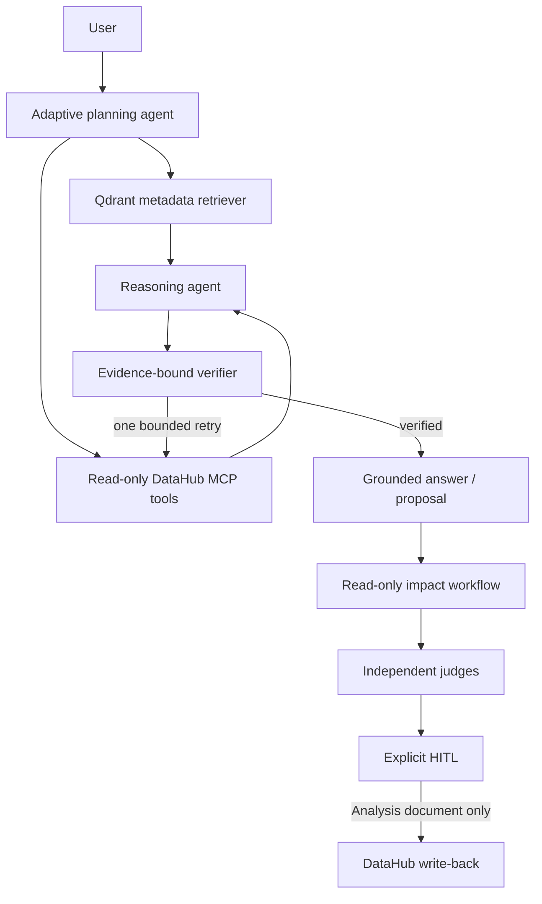

# LineageGuard AI

LineageGuard AI is an evidence-first DataHub application for the **Agents That
Do Real Work** track of the Build with DataHub Hackathon. It turns a proposed
schema change into a DataHub-backed impact report, a deterministic remediation
plan, independent reviews, and an auditable human-approved DataHub document
write-back.

The primary README remains in French. This English guide is the canonical
technical overview for reviewers.

## What the agent really does



- Qdrant contains only a metadata projection (URN, label, type, platform and
  owner URNs), never rows, SQL, GraphQL payloads or secrets.
- DataHub MCP remains the source of truth. The agent uses an allowlist of
  `search`, `list_schema_fields`, `get_lineage` and related read-only tools.
- Schema fields/types and lineage edges are converted into named evidence
  records. The answer must cite them; missing coverage triggers one bounded
  retry and then a safe limitation.
- The chat cannot write. A request can only propose the existing read-only
  impact analysis or the separate HITL flow.
- The only supported mutation is an Analysis document after deterministic Gate
  0, two approved final verdicts, an idempotency key and a human approval.

## Run locally

Prerequisites: Docker Desktop, Python 3.11+, Node 20+, and a local DataHub
Quickstart.

```powershell
Copy-Item .env.example .env
.\scripts\start-datahub.ps1
.\scripts\load-showcase-data.ps1
docker compose up --build -d
```

Open the UI at `http://localhost:5173`, the API at
`http://localhost:8000/docs`, DataHub at `http://localhost:9002`, and Qdrant
at `http://localhost:6333/dashboard`.

For a no-key UI demo, use `DEMO_MODE=true` and
`RAG_EMBEDDING_PROVIDER=local_hash`. This deterministic local retrieval is a
functional demo fallback, not a semantic-quality claim. Configure an OpenAI
embedding model and chat model for real semantic RAG.

## Evaluation

```powershell
Set-Location backend
python -m pytest tests -q -p no:cacheprovider
Set-Location ..
python evals/runners/run_deterministic_evals.py
python evals/runners/run_agentic_rag_evals.py
Set-Location frontend
npm run check
```

The Agentic RAG fixture baseline measures asset/lineage precision and recall,
schema exact match, tool-selection accuracy, evidence citation coverage,
unsupported-claim rates before/after verification, verification block rate,
p95 latency and estimated cost. It is clearly marked offline; do not represent
it as a live-provider benchmark.

For the opt-in live MCP document proof, see
[`docs/live-writeback-proof.md`](docs/live-writeback-proof.md).

## Important boundaries

- Do not commit `.env` or API keys.
- Keep `DATAHUB_WRITEBACK_ENABLED=false` except during an explicitly approved,
  disposable proof.
- Repository publication, video, deployment, and Devpost submission are final
  submission tasks and deliberately not automated by this repository.
- The Apache-2.0 license is at [`LICENSE`](LICENSE).
