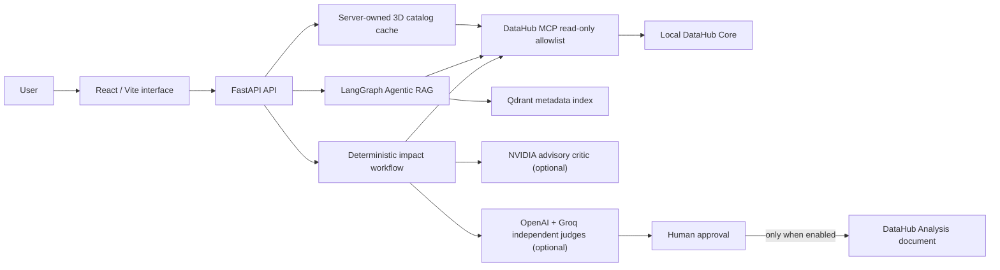
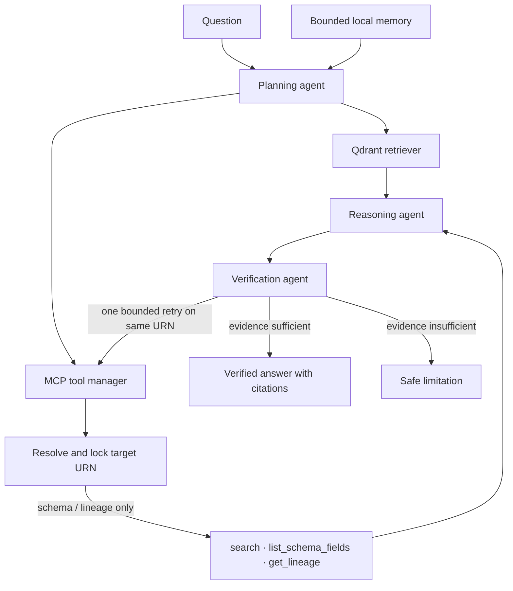
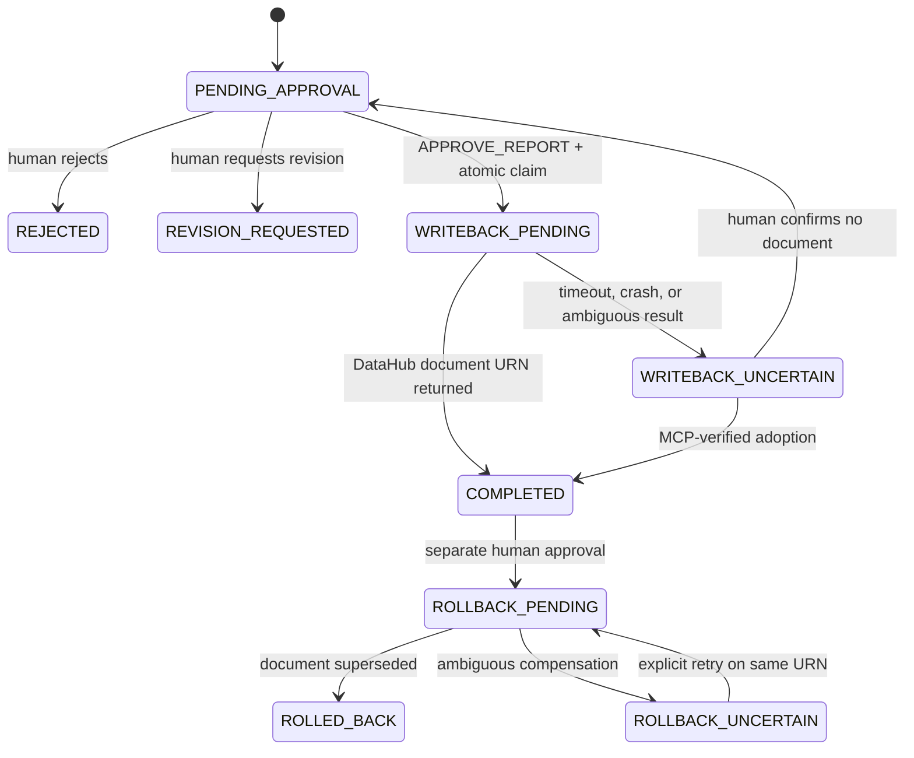

# LineageGuard AI

> Evidence-first DataHub agents for governed schema-change analysis, verified catalog answers, and human-approved documentation write-back.

LineageGuard AI is an Apache-2.0 prototype for the **Build with DataHub: The Agent Hackathon** in the **Agents That Do Real Work** track. It connects to a local DataHub instance through the official DataHub MCP server, reads live metadata and lineage, and turns that evidence into controlled human workflows.

The application never changes a warehouse schema, dbt model, lineage edge, dashboard, or source data. Its only possible mutation is a narrowly scoped **DataHub Analysis document**, and only after deterministic validation, independent review, explicit human approval, and an opt-in configuration flag.

## What it does

- Builds a read-only, evidence-backed impact report for `ADD_COLUMN`, `RENAME_COLUMN`, `CHANGE_COLUMN_TYPE`, and `DROP_COLUMN` requests.
- Produces deterministic risk scoring, remediation guidance, and a business rollback proposal marked `NOT_EXECUTED`.
- Runs an Agentic RAG assistant: planning → Qdrant retrieval → live DataHub MCP reads → grounded response → deterministic verification.
- Resolves exact DataHub targets before schema or lineage calls; ambiguous requests ask for a platform instead of guessing.
- Shows the full bounded DataHub catalog as an interactive 3D graph, including platform colors, lineage edges, hover metadata, and in-session LineageGuard activity.
- Uses optional NVIDIA advisory critique and independent OpenAI/Groq judges. No judge can call DataHub or write data.
- Routes write requests only to the existing human-in-the-loop (HITL) approval path.
- Serializes concurrent approvals with durable compare-and-swap, blocks retries
  after ambiguous remote outcomes, and requires MCP-verified reconciliation.
- Persists audit events, proposals, operation ownership, and idempotency bindings
  in local SQLite; Qdrant persists a safe metadata-only retrieval index.
- Persists each deterministic analysis as a server-owned snapshot; final judges
  receive an `analysis_run_id`, never a browser-submitted replacement report.

## Architecture



### Agentic RAG and MCP workflow



The public trace explains actions, tool choices, target resolution, and verification results. It deliberately does not expose hidden model reasoning or chain-of-thought.

## Trust boundaries and safety model

| Component | Trust level | Allowed data / action |
|---|---|---|
| DataHub MCP | Live source of truth | Fixed read-only allowlist: search, entities, schema, lineage, lineage paths, and dataset queries |
| Qdrant | Retrieval candidate store | URN, label, entity type, platform, and owners only; never table rows, SQL, tokens, or raw GraphQL payloads |
| Conversation memory | Local context only | At most six final turns by default; user-clearable; never evidence or tool authority |
| Chat action router | Proposal only | `NONE`, `ANALYZE_IMPACT`, or `HITL_WRITEBACK`; the chat itself has no write tool |
| NVIDIA / OpenAI / Groq | Optional external services | Receive a bounded, redacted workflow dossier only when their buttons are explicitly used |
| Write-back | Human-controlled | `save_document` for a DataHub Analysis document only, after all gates pass |

### Write-back state machine



`FINALIZE_READ_ONLY` means both judges passed their thresholds. It is **not** permission to write. The separate human decision and `DATAHUB_WRITEBACK_ENABLED=true` remain mandatory.

The local protocol guarantees one automatic writer claimant, not distributed
exactly-once delivery. If DataHub may have accepted a request but its response
is lost, LineageGuard enters an uncertain state and refuses to retry until a
human reconciles the exact document through live MCP evidence. Details and
failure procedures are in [Secure HITL write-back](docs/hitl-writeback.md).

## Quick start

### Prerequisites

- Windows 10/11, PowerShell, Git
- Docker Desktop using the Linux engine (WSL 2)
- Python 3.11+ for local checks
- Node.js 20+ for frontend checks

### 1. Prepare configuration

```powershell
Copy-Item .env.example .env
```

`.env` is ignored by Git. Never commit it or include keys in screenshots, logs, issues, or prompts.

### 2. Start DataHub and load sample metadata

```powershell
.\scripts\start-datahub.ps1
```

`start-datahub.ps1` loads `showcase-ecommerce` by default. Use `-SkipDatapack` only when you want to start DataHub without it, then run `./scripts/load-showcase-data.ps1` later. The local DataHub UI is available at <http://localhost:9002>. The showcase datapack is intentionally rich: it contains cross-platform assets, schemas, ownership, governance, and lineage.

### 3. Start LineageGuard

```powershell
docker compose up --build -d
docker compose ps
Invoke-RestMethod http://localhost:8000/api/v1/health
```

| Service | URL | Purpose |
|---|---|---|
| LineageGuard UI | <http://localhost:5173> | Main user interface |
| API documentation | <http://localhost:8000/docs> | OpenAPI contracts and manual checks |
| API health | <http://localhost:8000/api/v1/health> | Non-secret configuration health |
| DataHub | <http://localhost:9002> | Live metadata source of truth |
| Qdrant | <http://localhost:6333/dashboard> | Local vector-index administration |

Expected health shape:

```json
{
  "status": "ok",
  "datahub": "configured",
  "llm_providers": "configured",
  "qdrant": "configured",
  "demo_mode": false
}
```

The health endpoint reports configuration, not a guarantee that a paid provider has just completed a request.

## Operating the application

### 3D catalog

The API starts loading the catalog when the **backend process starts**, before a browser is opened. The root catalog becomes `READY` as soon as all bounded assets are available; lineage relationships continue to enrich in the background. The graph stays visible during a refresh and is replaced atomically only after a successful refreshed graph is ready.

- The browser polls the server-owned cache; it never initiates the full traversal.
- A scheduled poll compares stable root **URNs** only. It requires two identical changed observations before it starts another full lineage scan, preventing display/ranking fluctuations from causing repeated work.
- `READY` means the catalog is usable. The status message tells you when relationship enrichment is still in progress.
- Filtering and text search are client-side filters over the complete loaded graph. Selecting `All` restores every cached node.
- “Load 50 more assets” appears only if the server graph reached `CATALOG_MAX_ASSETS`; with a complete 1,188-asset showcase cache, no extra button is expected.

### Agentic RAG assistant

1. Select **Index DataHub metadata** once after loading or changing the DataHub datapack.
2. Wait for `INDEX READY`, then ask catalog, schema, or lineage questions.
3. Read the human-facing answer, target-resolution card, evidence citations, and optional technical trace.
4. Use **Clear memory** before independent professional tests; the normal six-turn memory remains useful for conversational follow-ups.

Re-indexing is non-blocking when a usable Qdrant collection already exists: the status becomes `CHAT READY · INDEXING`, and questions remain available against the existing index while the replacement index runs.

### Impact, review, and HITL

1. Submit a change request in the impact panel.
2. Review the deterministic evidence, affected assets, risk score, and non-executable remediation plan.
3. Optionally request the NVIDIA advisory critique.
4. Optionally run the two independent final judges. Gate 0 reloads the
   server-owned analysis and independently reconstructs evidence bindings,
   missing-metadata facts, every risk component, score, level, and confidence
   before either provider is called.
5. Only after a double PASS, prepare a proposal. Keep write-back disabled for normal demonstrations.

## Configuration reference

Only the variables below are consumed by the application. Empty values disable the corresponding optional provider capability.

```env
APP_ENV=development
DATABASE_URL=

DATAHUB_GMS_URL=http://host.docker.internal:8080
DATAHUB_GMS_TOKEN=
DATAHUB_WRITEBACK_ENABLED=false

QDRANT_URL=http://qdrant:6333
QDRANT_COLLECTION=lineageguard_datahub
RAG_EMBEDDING_PROVIDER=openai
RAG_EMBEDDING_MODEL=text-embedding-3-small
RAG_MAX_ASSETS=1500

CATALOG_AUTOLOAD=true
CATALOG_REFRESH_SECONDS=60
CATALOG_MAX_ASSETS=1500
CATALOG_MAX_EDGES=5000
CATALOG_LINEAGE_CONCURRENCY=8

CHAT_MEMORY_ENABLED=true
CHAT_MEMORY_MAX_TURNS=6
CHAT_MEMORY_CONTEXT_CHARS=6000
CHAT_MEMORY_TTL_HOURS=168

OPENAI_API_KEY=
OPENAI_CHAT_MODEL=gpt-4.1-mini
OPENAI_JUDGE_MODEL=gpt-4.1-mini
GROQ_API_KEY=
GROQ_JUDGE_MODEL=openai/gpt-oss-20b
NVIDIA_API_KEY=
NVIDIA_BASE_URL=https://integrate.api.nvidia.com/v1
NVIDIA_CRITIC_MODEL=
NVIDIA_TIMEOUT_SECONDS=90

JUDGE_TEMPERATURE=0
JUDGE_TIMEOUT_SECONDS=60
JUDGE_MAX_RETRIES=1

LANGSMITH_TRACING=true
LANGSMITH_API_KEY=
LANGSMITH_PROJECT=lineageguard-ai
LANGSMITH_ENDPOINT=https://api.smith.langchain.com
```

`LANGCHAIN_TRACING_V2`, `LANGCHAIN_API_KEY`, `LANGCHAIN_PROJECT`, and `LANGCHAIN_ENDPOINT` are supported as compatibility aliases. The application normalizes them to LangSmith variables at startup.

`WORKER_LLM_PROVIDER` and `WORKER_LLM_MODEL` are not application settings in the current implementation. The RAG planner/answer provider uses `OPENAI_CHAT_MODEL`; NVIDIA is currently the advisory critic, not the general chat provider.

### No-key demonstration mode

```env
DEMO_MODE=true
RAG_EMBEDDING_PROVIDER=local_hash
```

This mode supports local catalog caching, controlled ingestion, target resolution, MCP verification, and HITL routing without an external embedding account. `local_hash` is deterministic but is not a semantic-retrieval quality claim.

## Observability and tracing

LangGraph tracing is enabled automatically when `LANGSMITH_TRACING=true` and a LangSmith key is present. Named traces are created for:

- `lineageguard_agentic_rag_request`
- `lineageguard_nvidia_advisory_critic`
- `lineageguard_openai_judge`
- `lineageguard_groq_judge`

Use the LangSmith project to inspect timing, error states, token metadata, and trace hierarchy. Do not export raw inputs/outputs into public evidence unless they were reviewed for sensitive metadata. See [Tracing and operations](docs/runbook.md#tracing-and-operational-observability).

## Validation and evaluation

```powershell
# Backend unit, contract, security, agent, and workflow tests
Set-Location backend
python -m pytest tests -q -p no:cacheprovider

# Type check and production frontend build
Set-Location ..\frontend
npm run check

# Offline, no-cost RAG/MCP regression metrics
Set-Location ..
python .\evals\runners\run_agentic_rag_evals.py
```

The latest committed offline baseline measures retrieval identity, schema and lineage facts, tool selection, citation coverage, verifier blocking, latency, and cost without a provider call. The dated live showcase benchmark records `Precision@6=0.667`, `Recall@6=1.000`, `MRR@6=1.000`, and `NDCG@6=1.000` for its reviewed six-scenario suite. It is a local showcase measurement, not a production-quality claim.

For a professional end-to-end acceptance protocol, including required artifacts and a 20-query reviewed ground truth, use [the acceptance test plan](docs/acceptance-test-plan.md). For a dedicated disposable-environment write proof, use [the live write-back proof](docs/live-writeback-proof.md).

## Documentation

| Document | Use it for |
|---|---|
| [Architecture](docs/architecture.md) | Component boundaries, diagrams, data flow, and invariants |
| [Runbook](docs/runbook.md) | Installation, configuration, tracing, demo sequence, and operations |
| [API reference](docs/api-reference.md) | Current API routes and safe request flows |
| [Agentic RAG + MCP](docs/agentic-rag.md) | Retrieval, target resolution, memory, verification, and routing |
| [DataHub local setup](docs/datahub-local.md) | Local Quickstart and showcase datapack |
| [Double judging](docs/double-judging.md) | Gate 0, provider independence, fallback, and aggregation |
| [HITL write-back](docs/hitl-writeback.md) | Approval states, idempotency, audit, and compensation |
| [Troubleshooting](docs/troubleshooting.md) | Docker, DataHub, catalog, RAG, NVIDIA, Groq, and tracing diagnosis |
| [Evaluation assets](evals/README.md) | Offline and live evaluation methodology |

## Current boundaries and next work

- The 3D cache is in-memory and deliberately does not survive a backend restart.
- External DataHub changes are detected by bounded polling; there is no webhook integration.
- The Qdrant index contains metadata projections, so live MCP verification is always required before factual schema or lineage claims.
- Live quality, provider reliability, cost, and write-back success must be reported from reviewed runs; offline metrics are not substitutes.
- The 3D rendering dependency is code-split but remains a large optional browser chunk.

## License

Licensed under the [Apache License 2.0](LICENSE).
