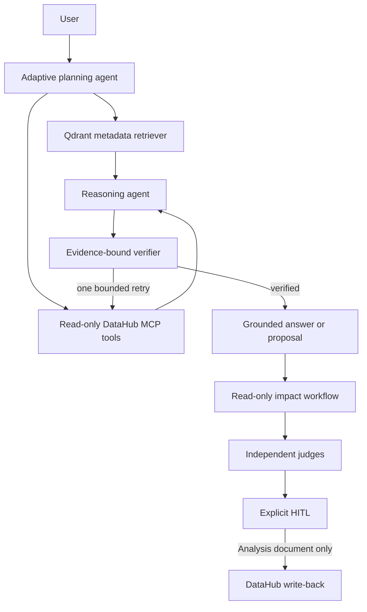

# LineageGuard AI

LineageGuard AI is an evidence-first DataHub application for the **Agents That
Do Real Work** track of the Build with DataHub Hackathon. It turns a proposed
schema change into a DataHub-backed impact report, a deterministic remediation
plan, independent reviews, and an auditable human-approved DataHub document
write-back.

## What the agent really does



- Qdrant contains only a metadata projection: URN, label, type, platform and
  owner URNs. It never stores table rows, SQL, GraphQL payloads or secrets.
- DataHub MCP remains the source of truth. The agent uses an allowlist of
  `search`, `list_schema_fields`, `get_lineage` and related read-only tools.
- Schema fields/types and lineage edges are converted into named evidence
  records. The answer must cite them; missing coverage triggers one bounded
  retry and then a safe limitation.
- The chat cannot write. A request can only propose the existing read-only
  impact analysis or the separate HITL flow.
- The only supported mutation is an Analysis document after deterministic Gate
  0, two approved final verdicts, an idempotency key and a human approval.

## Local run

Prerequisites: Docker Desktop, Python 3.11+, Node 20+, and a local DataHub
Quickstart.

```powershell
Copy-Item .env.example .env
.\scripts\start-datahub.ps1
.\scripts\load-showcase-data.ps1
docker compose up --build -d
```

Open the UI at `http://localhost:5173`, the API at
`http://localhost:8000/docs`, DataHub at `http://localhost:9002`, and Qdrant
at `http://localhost:6333/dashboard`.

## Configuration

Copy `.env.example` to `.env`; never commit it or expose its values.

```env
APP_ENV=development
DATAHUB_GMS_URL=http://host.docker.internal:8080
DATAHUB_WRITEBACK_ENABLED=false

QDRANT_URL=http://qdrant:6333
QDRANT_COLLECTION=lineageguard_datahub
RAG_EMBEDDING_PROVIDER=openai
RAG_EMBEDDING_MODEL=text-embedding-3-small
OPENAI_CHAT_MODEL=gpt-4.1-mini

OPENAI_API_KEY=...
OPENAI_JUDGE_MODEL=gpt-4.1-mini
GROQ_API_KEY=...
GROQ_JUDGE_MODEL=...
NVIDIA_API_KEY=...
NVIDIA_CRITIC_MODEL=...
```

For a no-key UI demo, use:

```env
DEMO_MODE=true
RAG_EMBEDDING_PROVIDER=local_hash
```

This deterministic fallback exercises ingestion, MCP verification and HITL
without an external provider. It is a functional demonstration mode, not a
semantic-RAG quality claim.

## Demonstration flow

1. Load the DataHub showcase datapack.
2. Open the UI and start controlled metadata indexing.
3. Ask a catalog, schema or lineage question. Inspect the visible agent trace,
   DataHub MCP evidence and citations.
4. Submit a schema change for read-only impact analysis.
5. Optionally run the NVIDIA advisory critic and two independent final judges.
6. A document write-back proposal is available only after Gate 0, double PASS,
   and explicit human approval.

The default is always read-only. The project never mutates a warehouse schema,
dataset, lineage edge, dbt job or BI dashboard.

## Evaluation

```powershell
Set-Location backend
python -m pytest tests -q -p no:cacheprovider
Set-Location ..
python evals/runners/run_deterministic_evals.py
python evals/runners/run_agentic_rag_evals.py
Set-Location frontend
npm run check
```

The Agentic RAG fixture baseline measures asset and lineage precision/recall,
schema exact match, tool-selection accuracy, evidence citation coverage,
unsupported-claim rates before and after verification, verification block rate,
p95 latency and estimated cost. It is an offline fixture baseline, not a live
provider benchmark.

The latest generated report is available at
[`evals/reports/agentic-rag-baseline.md`](evals/reports/agentic-rag-baseline.md).
The deterministic workflow report is at
[`evals/reports/final-evaluation.md`](evals/reports/final-evaluation.md).

## Live DataHub write-back proof

[`docs/live-writeback-proof.md`](docs/live-writeback-proof.md) documents an
opt-in integration test. It creates then supersedes one local DataHub Analysis
document, validates its URN and records the audit events. It is skipped by
default and requires two explicit environment confirmations.

## Technical documentation

- [Agentic RAG + DataHub MCP](docs/agentic-rag.md)
- [API reference](docs/api-reference.md)
- [Operational runbook](docs/runbook.md)
- [Live write-back proof](docs/live-writeback-proof.md)

## Submission boundaries

The final submission tasks — public repository verification, deployment,
Devpost description and public demo video — are intentionally not automated by
this repository. The project is licensed under [Apache-2.0](LICENSE).
