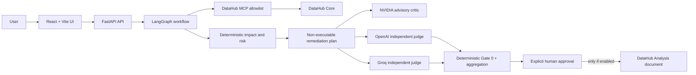
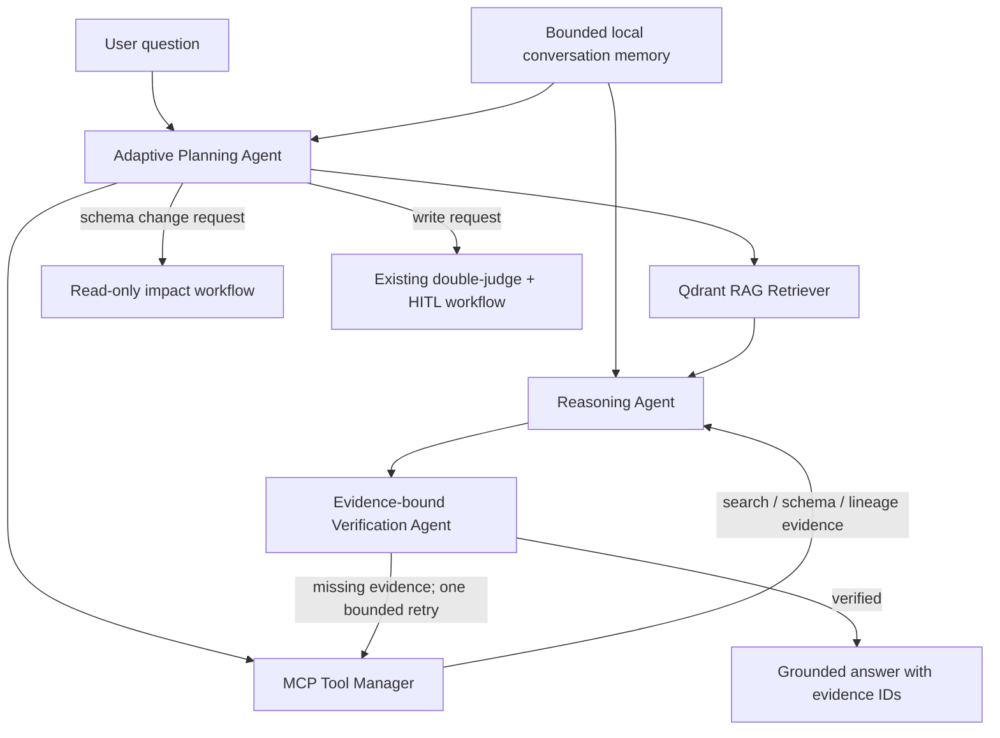
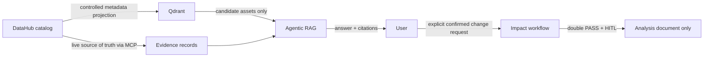
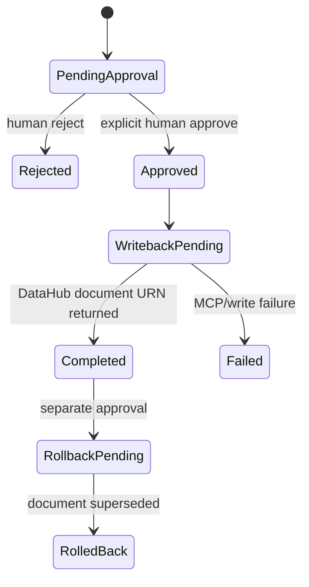

# LineageGuard AI

> Evidence-first DataHub agents for safe schema-change impact analysis,
> grounded catalog questions, and human-approved documentation write-back.

LineageGuard AI is an open-source prototype built for the **Build with
DataHub: The Agent Hackathon**, track **Agents That Do Real Work**. It uses a
local DataHub Core instance through the DataHub MCP server to read real
metadata, schemas and lineage. It then combines deterministic controls,
LangGraph orchestration, independent model reviews and explicit human approval
to decide whether a DataHub Analysis document may be written back.

The project deliberately does **not** alter warehouse schemas, dbt models,
DataHub lineage edges, datasets, dashboards, or SQL. Its only supported write
is a scoped Analysis document after all safety gates pass.

## Why LineageGuard AI

A schema-change request is rarely just a SQL change. It can affect downstream
pipelines, dashboards, ownership, contracts and business users. LineageGuard
turns an input such as “drop `customer_status` from `orders`” into an auditable
workflow:

1. Read the actual DataHub schema, lineage and ownership metadata through MCP.
2. Build a deterministic impact report and risk score with traceable evidence.
3. Produce a non-executable remediation and rollback plan.
4. Optionally obtain an advisory NVIDIA critique and two independent final
   verdicts from OpenAI and Groq.
5. Require a human to explicitly approve a scoped DataHub document write-back.
6. Persist an audit trail, idempotency key and rollback/supersession path.

## Architecture

### Governed impact-analysis workflow



### Agentic RAG + DataHub MCP

The assistant is not a simple “retrieve then answer” chatbot. It uses a
bounded LangGraph state graph and exposes its public execution trace without
revealing private chain-of-thought.



| Agent | Responsibility | Safety boundary |
|---|---|---|
| Planning agent | Creates a compact read-only retrieval plan | Uses structured JSON when a chat model is configured; otherwise visibly falls back to deterministic classification |
| RAG retriever | Retrieves candidate metadata from Qdrant | Qdrant stores metadata projections only, never table rows or SQL |
| MCP tool manager | Calls live DataHub `search`, `list_schema_fields`, and `get_lineage` when relevant | Fixed read-only allowlist and bounded result counts |
| Reasoning agent | Produces a concise answer from source candidates and live evidence | Must cite evidence IDs for schema and lineage claims |
| Verification agent | Checks evidence coverage and cited evidence IDs | Performs at most one bounded read retry; otherwise returns a safe limitation |
| Conversation memory | Resolves references across a browser session | Local SQLite, bounded, expiring, user-clearable, and never treated as evidence |
| Action router | Suggests impact analysis or HITL when requested | Chat has no write tool and cannot bypass existing gates |

### Data lifecycle and trust boundaries



Qdrant indexes only:

- DataHub URN
- Display label
- Entity type
- Platform URN
- Owner URNs

It does **not** index table contents, raw records, SQL text, credentials,
tokens, GraphQL payloads or hidden DataHub metadata. DataHub MCP remains the
source of truth for dynamic schema, lineage, ownership and search results.

## Safety model

### DataHub MCP permissions

The regular agent bridge allows only these read operations:

- `search`
- `get_entities`
- `list_schema_fields`
- `get_lineage`
- `get_lineage_paths_between`
- `get_dataset_queries`

The dedicated write-back path permits only `save_document`, and only when
`DATAHUB_WRITEBACK_ENABLED=true` **and** the preceding safeguards passed.

### Deterministic Gate 0

Before any final judge is considered, Gate 0 verifies:

- DataHub URN validity
- Source/impact lineage-path consistency
- Every impacted asset references valid evidence IDs
- Requested columns are supported by schema evidence when applicable
- Risk-score recalculation matches the report
- Remediation and rollback plans are marked `NOT_EXECUTED`

### Write-back guardrails



Write-back requires deterministic Gate 0 success, a `FINALIZE_READ_ONLY`
aggregate decision, an idempotency key, a human `APPROVE_REPORT` decision, and
the explicit environment flag. The compensation action supersedes the created
document; it never attempts a database rollback or schema mutation.

## Repository layout

```text
backend/
  app/api/v1/              FastAPI routes
  app/datahub/             Narrow DataHub MCP client
  app/services/            LangGraph, RAG, impact, judging and write-back logic
  tests/                   Unit, contract and opt-in integration tests
frontend/
  src/App.tsx              Demo dashboard and 3D catalog explorer
  src/                     Vite/React assets and styles
docs/                      Runbook, API reference, RAG and proof documentation
evals/
  datasets/                Versioned deterministic evaluation fixtures
  runners/                 Reproducible metric runners
  reports/                 Tracked baseline reports
examples/
  outputs/                 Redacted representative output fixtures
scripts/                   Local DataHub startup and datapack loaders
```

## Prerequisites

- Windows 10/11, PowerShell and Git
- Docker Desktop running with the Linux engine
- Python 3.11+ for local backend checks
- Node.js 20+ for local frontend checks
- A local DataHub Quickstart instance

## Quick start

### 1. Create local configuration

```powershell
Copy-Item .env.example .env
```

`.env` is ignored by Git. Do not commit it, paste it into issues, or include it
in a screenshot.

### 2. Start DataHub and load the showcase datapack

```powershell
.\scripts\start-datahub.ps1
.\scripts\load-showcase-data.ps1
```

DataHub local UI: <http://localhost:9002>

### 3. Start LineageGuard

```powershell
docker compose up --build -d
docker compose ps
```

| Service | URL | Purpose |
|---|---|---|
| Frontend | <http://localhost:5173> | Interactive governed demo |
| API docs | <http://localhost:8000/docs> | OpenAPI and manual checks |
| API health | <http://localhost:8000/api/v1/health> | Safe configuration health |
| Qdrant | <http://localhost:6333/dashboard> | Local metadata vector index |
| DataHub | <http://localhost:9002> | Metadata source of truth |

The health endpoint reports **configuration state** without exposing secrets or
claiming that an external provider completed a live request:

```json
{
  "status": "ok",
  "datahub": "configured",
  "llm_providers": "configured",
  "qdrant": "configured",
  "demo_mode": false
}
```

## Configuration reference

```env
APP_ENV=development
DATABASE_URL=

DATAHUB_GMS_URL=http://host.docker.internal:8080
DATAHUB_GMS_TOKEN=
DATAHUB_WRITEBACK_ENABLED=false

QDRANT_URL=http://qdrant:6333
QDRANT_COLLECTION=lineageguard_datahub
RAG_EMBEDDING_PROVIDER=openai
RAG_EMBEDDING_MODEL=text-embedding-3-small
RAG_MAX_ASSETS=1500
CHAT_MEMORY_ENABLED=true
CHAT_MEMORY_MAX_TURNS=6
CHAT_MEMORY_CONTEXT_CHARS=6000
CHAT_MEMORY_TTL_HOURS=168

CATALOG_AUTOLOAD=true
CATALOG_REFRESH_SECONDS=60
CATALOG_MAX_ASSETS=1500
CATALOG_MAX_EDGES=5000
CATALOG_LINEAGE_CONCURRENCY=8

OPENAI_API_KEY=
OPENAI_CHAT_MODEL=gpt-4.1-mini
OPENAI_JUDGE_MODEL=gpt-4.1-mini
GROQ_API_KEY=
GROQ_JUDGE_MODEL=
NVIDIA_API_KEY=
NVIDIA_BASE_URL=https://integrate.api.nvidia.com/v1
NVIDIA_CRITIC_MODEL=

LANGSMITH_TRACING=false
LANGSMITH_API_KEY=
LANGSMITH_PROJECT=lineageguard-ai
```

### No-key demonstration mode

Use this only for a functional local demonstration when no external provider
key is available:

```env
DEMO_MODE=true
RAG_EMBEDDING_PROVIDER=local_hash
```

`local_hash` is deterministic and local. It lets reviewers exercise controlled
ingestion, retrieval, MCP verification and HITL routing without creating an
external account. It is intentionally **not** presented as a semantic-embedding
quality result. Configure OpenAI embeddings for real semantic RAG.

### Conversation memory and cost telemetry

The chat creates a random browser-session ID and persists at most six final
question/answer pairs in the local SQLite volume for seven days by default.
It can be disabled per request and erased from the UI. It is context only: it
helps resolve a follow-up such as “and what is its schema?”, but it never
authorizes a tool call or counts as DataHub evidence. No API keys, raw MCP
payloads, chain-of-thought, credentials or HITL approvals are stored.

When an OpenAI chat model is used, each response also displays safe metering:
model ID, aggregate planning-and-answer tokens, and a text-token cost estimate.
The estimate is intentionally omitted for unknown model pricing rather than
invented.

### Server-side 3D catalog cache

The 3D catalog begins loading when the **API server starts**, not when a user
opens the web page. One in-memory cache is shared by every browser connected to
that server instance. The UI only reads and displays the cache.

- `CATALOG_AUTOLOAD=true` enables background startup loading.
- `CATALOG_MAX_ASSETS` and `CATALOG_MAX_EDGES` bound resource use.
- `CATALOG_LINEAGE_CONCURRENCY` limits parallel MCP lineage reads.
- The server polls DataHub catalog identity every `CATALOG_REFRESH_SECONDS`.
- A LineageGuard impact analysis, lineage expansion, approved write-back or
  compensation immediately records a node action. Write-back also requests an
  immediate graph refresh.
- The catalog panel displays `RUNNING`, `READY`, `STALE`, or `FAILED`, counts,
  update timestamp and refresh reason. Hover a 3D node for its metadata and
  recent LineageGuard actions; click it for the complete activity list.

DataHub Core is not configured here with push/webhook events. Therefore
external schema or lineage changes are reflected on the next polling pass, or
immediately when the user presses **Refresh from DataHub**.

## Demonstration script

1. Start the LineageGuard server. It begins loading the bounded 3D catalog in
   the background before any browser is opened.
2. Open the UI and watch the catalog cache status become `READY`; no manual
   catalog-load action is required. Hover a node to inspect its details and
   recorded LineageGuard actions.
3. Click **Index DataHub metadata** in the Agentic RAG panel. Wait for
   `COMPLETED`.
4. Ask a schema or lineage question. Inspect the public agent trace, MCP
   evidence records, source citations and verification outcome.
5. Submit an `ADD_COLUMN` request for the example asset. Review the deterministic
   impact report, risk score, evidence IDs and non-executable remediation plan.
6. Optionally run the NVIDIA critic and then OpenAI + Groq judges. These are
   external calls and may incur cost.
7. Only after a double PASS, prepare an HITL proposal. Keep write-back disabled
   for a standard demo.

## API overview

| Method | Route | Effect |
|---|---|---|
| `GET` | `/api/v1/health` | Safe runtime configuration health |
| `GET` | `/api/v1/datahub/search` | Read-only DataHub search |
| `GET` | `/api/v1/datahub/schema` | Read-only schema lookup |
| `GET` | `/api/v1/datahub/lineage` | Bounded lineage lookup |
| `GET` | `/api/v1/datahub/catalog/cache` | Server-loaded 3D graph and freshness state |
| `POST` | `/api/v1/datahub/catalog/cache/refresh` | Non-blocking manual refresh request |
| `GET` | `/api/v1/datahub/catalog/snapshot` | Legacy bounded page projection |
| `POST` | `/api/v1/workflows/analyze` | DataHub impact analysis and deterministic plan |
| `POST` | `/api/v1/workflows/critique` | Manual NVIDIA advisory critique |
| `POST` | `/api/v1/workflows/judge` | Gate 0 and independent final judges |
| `GET` | `/api/v1/chat/index/status` | Qdrant index status |
| `POST` | `/api/v1/chat/index/ingest` | Controlled metadata-only ingestion |
| `POST` | `/api/v1/chat/query` | Agentic RAG + live MCP verification |
| `GET` | `/api/v1/chat/memory/{session_id}` | Safe session-memory status only |
| `DELETE` | `/api/v1/chat/memory/{session_id}` | Erase the caller's local conversation memory |
| `POST` | `/api/v1/chat/execute-analysis` | Explicit chat-to-impact handoff |
| `POST` | `/api/v1/writebacks/prepare` | Prepare an HITL write proposal |
| `POST` | `/api/v1/writebacks/{run_id}/approve` | Human decision; document write only if enabled |

Full route contracts are in [docs/api-reference.md](docs/api-reference.md).

## Validation and tests

Run backend tests:

```powershell
Set-Location backend
python -m pytest tests -q -p no:cacheprovider
```

Current local validation after the latest reliability changes:

| Check | Result |
|---|---:|
| Backend tests | **53 passed** |
| Opt-in integration tests | **4 skipped** by default |
| Frontend `npm run check` | Passed |
| Docker frontend endpoint | HTTP 200 |
| Docker API health endpoint | HTTP 200 |

The skipped tests require live local services or an explicit write-back
confirmation. They are intentionally excluded from normal CI to prevent an
accidental external call or mutation.

### Deterministic workflow evaluation

```powershell
python evals/runners/run_deterministic_evals.py
```

This checks a versioned 20-case dataset with five cases each for `ADD_COLUMN`,
`RENAME_COLUMN`, `CHANGE_COLUMN_TYPE`, and `DROP_COLUMN`. The fixture covers
missing lineage, absent assets/columns, missing owners, multi-hop lineage,
cross-platform metadata, prompt injection, provider timeouts, judge
disagreement and write-back failures.

### Agentic RAG + MCP evaluation

```powershell
python evals/runners/run_agentic_rag_evals.py
```

Latest committed offline fixture baseline:

| Metric | Value | Meaning |
|---|---:|---|
| Cases | 5 | Positive schema/lineage and negative no-proof fixtures |
| Asset precision / recall | 1.00 / 1.00 | Fixture-grounded retrieval identity |
| Lineage precision / recall | 1.00 / 1.00 | Fixture-grounded lineage facts |
| Schema exact match | 1.00 | Expected field/type facts match the fixture |
| Tool-selection accuracy | 1.00 | Correct MCP tools selected by the fixture plan |
| Citation coverage for verified answers | 1.00 | Supported answers cite evidence |
| Unsupported-claim rate before guard | 0.40 | Deliberate adversarial/no-proof cases |
| Unsupported-claim rate after verifier | 0.00 | Unsafe cases are blocked instead of answered |
| Verification block rate | 1.00 | All no-proof cases are safely blocked |
| Mean / p95 latency | 438 ms / 540 ms | Offline fixture timing, not network latency |
| Estimated provider cost | $0.00 | Offline fixture runner makes no provider calls |

These numbers are reproducible **offline fixture measurements**, not a claim
about live-model accuracy or production latency. A live benchmark must record a
reviewed DataHub ground truth, datapack version, provider/model version, token
ledger, latency distribution and reviewer sign-off. See
[evals/reports/agentic-rag-baseline.md](evals/reports/agentic-rag-baseline.md).

### Live showcase evaluation

The dated live benchmark uses six read-only scenarios against local
showcase-ecommerce DataHub: catalog retrieval, schema and lineage questions,
impact routing, write/HITL routing, and a nonexistent-asset safety case.

| Category | Metric | Result |
|---|---|---:|
| Retrieval | Precision@6 | 0.667 |
| Retrieval | Recall@6 / MRR@6 / NDCG@6 | 1.000 / 1.000 / 1.000 |
| Agents | Router / tool / verification accuracy | 1.000 / 1.000 / 1.000 |
| Safety | Unsupported-claim block rate | 1.000 |
| Evidence | Verified-citation coverage | 1.000 |
| Performance | Mean / p50 / p95 latency | 23.1 s / 19.5 s / 41.1 s |
| Cost | Retained-run tokens / estimate | 8,406 / $0.004661 |

`Precision@6 = 0.667` is expected for this strict ground truth: four manually
reviewed `orders` datasets were returned among six citations. Recall and MRR
show that all four were retrieved and that a relevant dataset ranked first; the
two remaining citations were related metadata but were not counted as relevant
datasets. The benchmark presently has one independently labelled retrieval
query, so it is a local showcase result rather than a general quality claim.

The report also records a security fix found by evaluation: a Qdrant candidate
cannot be promoted to a schema or lineage tool target without a current
DataHub MCP search match. See the
[dated live evaluation report](evals/reports/live-agentic-rag-2026-07-23.md)
for methodology, metric definitions, model cost assumptions and limitations.

## Live write-back proof

The repository includes an explicit opt-in integration proof:

```powershell
Set-Location backend
$env:RUN_DATAHUB_WRITEBACK_PROOF = "1"
$env:CONFIRM_LIVE_WRITEBACK = "I_APPROVE_DEMO_DOCUMENT"
$env:DATAHUB_WRITEBACK_ENABLED = "true"
$env:DATAHUB_GMS_URL = "http://localhost:8080"
python -m pytest tests/integration/test_live_writeback_proof.py -q -p no:cacheprovider
```

It creates one Analysis document through the live DataHub MCP server, verifies
the returned document URN and audit events, then supersedes that document as a
scoped compensation action. This is a real DataHub mutation, so it is skipped
unless both confirmation variables are explicitly set. It uses a synthetic
double-PASS fixture to prove the MCP write/rollback path only; it does not
claim to benchmark judge quality.

Detailed procedure: [docs/live-writeback-proof.md](docs/live-writeback-proof.md).

## Known limitations and next improvements

- The 3D renderer is lazy-loaded, but its dedicated chunk is approximately
  1.38 MB before gzip. Further component-level splitting and renderer tuning
  are worthwhile for slower networks.
- `frontend/src/App.tsx` is still a large composition file and should be split
  into feature components before production use.
- Qdrant is a convenience index, not a full DataHub mirror. Live MCP remains
  mandatory for current schema and lineage claims.
- The current result-diversity metric is a transparent proxy. A true MMR
  reranker is a future improvement and is not claimed by the benchmark.
- Retrieval ranking metrics currently have one manually labelled showcase
  question. A 20+ query cross-platform ground-truth set is needed before
  comparing models or making broader quality claims.
- Offline fixture metrics establish regression coverage, not live quality.
- The local Compose stack has no production authentication, RBAC, secrets
  manager, high-availability database or hosted deployment profile.
- A final hackathon submission still requires a public repository check,
  public demo video, English Devpost description and deployment/demo URL as
  applicable. Those submission actions are intentionally not automated here.

## Documentation

- [Agentic RAG + DataHub MCP](docs/agentic-rag.md)
- [API reference](docs/api-reference.md)
- [Operational runbook](docs/runbook.md)
- [Live write-back proof](docs/live-writeback-proof.md)
- [Deterministic evaluation report](evals/reports/final-evaluation.md)
- [Agentic RAG evaluation report](evals/reports/agentic-rag-baseline.md)
- [Live Agentic RAG evaluation report](evals/reports/live-agentic-rag-2026-07-23.md)

## License

Licensed under [Apache License 2.0](LICENSE).
