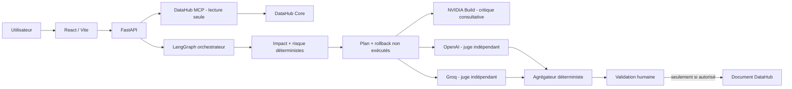
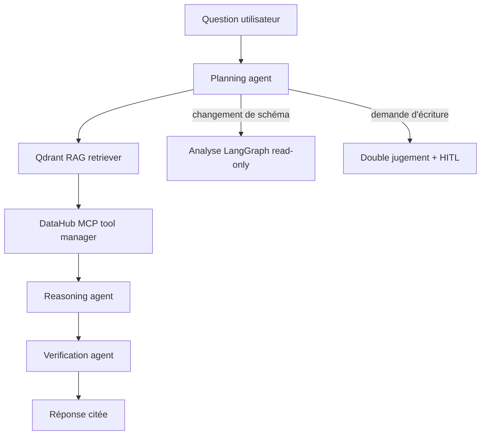
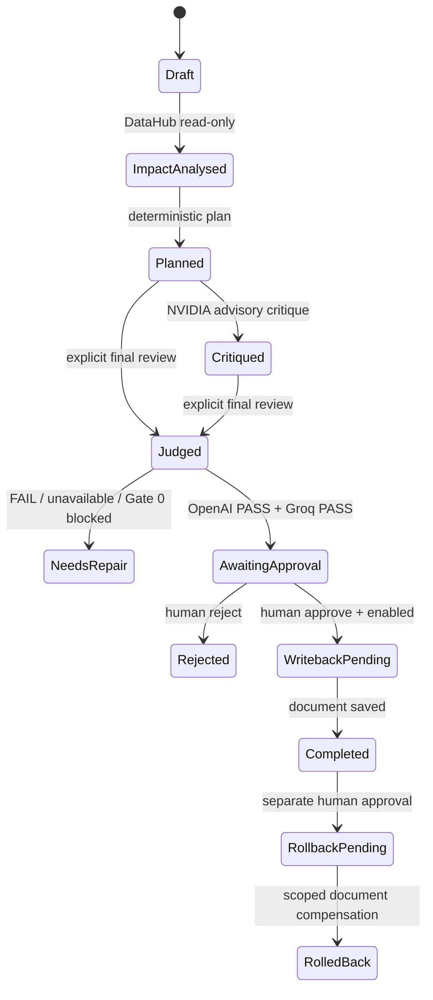

# LineageGuard AI

LineageGuard AI est une application de gouvernance de changements de schéma pour le track **Agents That Do Real Work** du hackathon *Build with DataHub*. Elle transforme une demande de changement en rapport d'impact fondé sur DataHub, plan déterministe, critique consultative NVIDIA, revue indépendante OpenAI + Groq et, seulement si les contrôles passent, proposition de write-back soumise à validation humaine.

> Aucun LLM ne modifie DataHub, dbt, SQL ou un entrepôt. Toute écriture DataHub reste désactivée par défaut.

## Démonstration rapide

1. Démarrer DataHub local et charger les données exemple.
2. Démarrer LineageGuard avec Docker.
3. Ouvrir <http://localhost:5173>.
4. Analyser une demande, lancer la critique NVIDIA, puis lancer volontairement les deux juges finaux.
5. Examiner les preuves, les justifications auditées et la décision. Une proposition HITL apparaît uniquement après un double `PASS`.



## Garanties de sécurité

- Le bridge MCP autorise uniquement six outils de lecture DataHub.
- Les textes provenant de DataHub sont traités comme des données non fiables, jamais comme des instructions.
- Chaque actif impacté porte des `evidence_ids` qui renvoient aux preuves DataHub.
- Gate 0 valide preuves, URN, chemin de lineage, score de risque et statuts non exécutés avant les juges.
- OpenAI et Groq reçoivent le même dossier compact, sans voir le verdict de l'autre.
- Les modèles produisent une **justification auditable** courte ; leurs chaînes de pensée privées ne sont ni demandées, ni affichées, ni stockées.
- Le write-back requiert Gate 0, double `PASS`, clé d'idempotence, snapshot et décision humaine explicite.

## LangGraph, lineage et tracing

Le backend orchestre les transitions **analyse → plan**, **critique** et **double jugement** avec un vrai `StateGraph` LangGraph. Chaque action externe reste déclenchée manuellement depuis l'interface : le graphe ne donne aucun outil aux LLM et ne peut pas contourner le HITL.

L'interface montre deux graphes complémentaires : le workflow d'exécution (états `PENDING`, `RUNNING`, `COMPLETED` et `AWAITING_HUMAN`) et le lineage DataHub réellement observé après l'analyse. Aucun lineage n'est inventé par un modèle.

Elle propose aussi une **carte 3D dynamique** du catalogue local : chaque point est un actif DataHub et chaque lien provient d'un appel `get_lineage` observé. La carte charge 50 actifs et 300 relations à la fois pour rester interactive ; le bouton de chargement progressif ajoute les pages suivantes à la même visualisation, sans obliger l'utilisateur à rechercher un actif.

La carte se charge en arrière-plan : son chargement ne bloque plus l'analyse d'impact, les juges, ni le nouvel assistant. L'assistant applique une architecture **Agentic RAG + MCP** : Qdrant retrouve une projection sûre de métadonnées, DataHub MCP vérifie les actifs en direct, puis le modèle répond avec des citations. Il ne dispose d'aucun outil d'écriture ; une demande de changement est routée vers l'analyse LangGraph en lecture seule, et une demande d'écriture vers le HITL existant.

## Assistant Agentic RAG + MCP

Le chat est un graphe LangGraph exécutable, pas un simple appel « retrieve then answer » :



| Étape | Rôle | Garantie |
|---|---|---|
| Planning agent | Classe la question et sélectionne les lectures utiles | Aucun outil d'écriture disponible |
| RAG retriever | Découvre les actifs pertinents dans Qdrant | Projection de métadonnées uniquement |
| MCP tool manager | Lit `search`, `list_schema_fields` et `get_lineage` selon la demande | Liste blanche MCP, lecture seule |
| Reasoning agent | Rédige à partir des sources RAG et MCP | Réponse citée, aucune action externe |
| Verification agent | Contrôle la présence de citations et de résultats MCP live | Ne prétend pas à une vérification inexistante |

Qdrant n'est pas une copie de DataHub : il ne stocke ni lignes de tables, ni SQL, ni secrets, ni payloads GraphQL. Les aspects dynamiques — schéma, lineage, propriétaires et recherche — restent lus à la demande via DataHub MCP. Après le chargement local `showcase-ecommerce`, l'index contrôlé a indexé **1 188 actifs catalogués** ; cette métrique peut varier avec le datapack ou la version DataHub.

### Évaluation et métriques locales

| Mesure | Résultat observé |
|---|---:|
| Tests backend déterministes | 46 réussis |
| Tests d'intégration optionnels | 3 ignorés hors services externes |
| Build TypeScript + Vite | réussi |
| Actifs Qdrant indexés | 1 188 |
| Évaluation live lineage | 5 étapes agentiques complétées |
| Outils MCP live validés | `search`, fallback par actif, `get_lineage` |
| Mutations DataHub depuis le chat | 0 — interdites par conception |

L'évaluation live contrôle le chemin `planning → RAG → MCP → reasoning → verification`. L'interface affiche cette trace publique et concise après chaque réponse ; elle n'affiche jamais de chaîne de pensée privée.

L'explorateur de catalogue permet aussi de rechercher des actifs DataHub, de les filtrer localement par type et plateforme, puis de charger au clic leur lineage amont ou aval. Chaque chargement est borné à 100 actifs : l'application ne télécharge jamais tout le catalogue en une fois.

Le tracing LangSmith est facultatif. Les variables `LANGSMITH_*` sont recommandées ; les anciennes variables `LANGCHAIN_*` sont aussi reconnues et normalisées au démarrage. Le backend n'affiche jamais de clé. Les traces ne sont activées que si le flag de tracing et une clé LangSmith sont tous les deux présents.



## Prérequis

- Windows 10/11, PowerShell et Git.
- Docker Desktop avec moteur Linux démarré.
- Python 3.11+ et Node.js 20+ pour les vérifications locales hors Docker.
- Une instance DataHub locale ; le script du projet installe et charge le jeu de démonstration.
- Comptes/API keys pour NVIDIA Build, OpenAI et Groq si vous souhaitez appeler les modèles externes.

## Installation locale

Depuis la racine du dépôt dans PowerShell :

```powershell
Copy-Item .env.example .env
python -m venv backend\.venv
backend\.venv\Scripts\python.exe -m pip install -e "backend[dev]"
Set-Location frontend
npm install
Set-Location ..
```

### 1. Démarrer DataHub et les données de démonstration

```powershell
.\scripts\start-datahub.ps1
```

DataHub est alors disponible sur <http://localhost:9002> (`datahub` / `datahub` en environnement local). Pour recharger les données exemple sans redémarrer :

```powershell
.\scripts\load-showcase-data.ps1
```

### 2. Configurer `.env` sans jamais le committer

Le fichier `.env` est ignoré par Git. Remplissez les valeurs suivantes avec vos propres secrets ; ne les collez jamais dans un commit, une capture ou un chat.

```env
APP_ENV=development
DATAHUB_GMS_URL=http://host.docker.internal:8080
DATAHUB_WRITEBACK_ENABLED=false

WORKER_LLM_PROVIDER=nvidia
WORKER_LLM_MODEL=z-ai/glm-5.2
NVIDIA_BASE_URL=https://integrate.api.nvidia.com/v1
NVIDIA_API_KEY=...
NVIDIA_CRITIC_MODEL=z-ai/glm-5.2
NVIDIA_TIMEOUT_SECONDS=90

LANGSMITH_TRACING=true
LANGSMITH_API_KEY=...
LANGSMITH_PROJECT=lineageguard-ai
LANGSMITH_ENDPOINT=https://api.smith.langchain.com

OPENAI_API_KEY=...
OPENAI_JUDGE_MODEL=gpt-4.1-mini
OPENAI_CHAT_MODEL=gpt-4.1-mini
RAG_EMBEDDING_MODEL=text-embedding-3-small
RAG_MAX_ASSETS=1500
QDRANT_URL=http://qdrant:6333
QDRANT_COLLECTION=lineageguard_datahub
GROQ_API_KEY=...
GROQ_JUDGE_MODEL=openai/gpt-oss-20b
JUDGE_TEMPERATURE=0
JUDGE_TIMEOUT_SECONDS=60
JUDGE_MAX_RETRIES=1

MAX_REPAIR_CYCLES=2
MAX_LINEAGE_DEPTH=3
MAX_IMPACTED_ASSETS=50
HITL_REQUIRED_FOR_MUTATION=true
VITE_API_BASE_URL=http://localhost:8000
```

Les procédures de création et de rotation des clés sont détaillées dans [le runbook](docs/runbook.md#fournisseurs-ia-et-clés). Le code ne lit jamais les secrets dans les logs ou l'interface.

### 3. Démarrer LineageGuard

```powershell
docker compose up --build -d
docker compose ps
```

Services attendus :

| Service | URL | Rôle |
|---|---|---|
| Interface | <http://localhost:5173> | Démonstration gouvernée |
| API | <http://localhost:8000/docs> | OpenAPI / tests manuels |
| Santé API | <http://localhost:8000/api/v1/health> | Vérification backend |
| Qdrant | <http://localhost:6333/dashboard> | Index vectoriel de métadonnées sûres |
| DataHub | <http://localhost:9002> | Métadonnées de démo |

## Parcours de démonstration dans l'interface

1. Saisir ou conserver l'URN exemple et choisir un changement ; privilégier `ADD_COLUMN` nullable pour une démo à risque faible.
2. Cliquer **Analyser l'impact et générer le plan**. Cette étape appelle seulement DataHub en lecture et le planificateur déterministe.
3. Examiner le rapport : actifs, lineage, score, formule de risque, limites et identifiants de preuve.
4. Cliquer **Lancer la critique NVIDIA**. C'est un avis consultatif, sans mutation et sans changement automatique du plan.
5. Cliquer **Lancer OpenAI + Groq** seulement lorsque vous acceptez les appels externes. Les deux juges sont indépendants.
6. Ouvrir les sections **Justification auditable** : elles donnent les critères observables et preuves, sans exposer de raisonnement privé.
7. Si la décision est `FINALIZE_READ_ONLY`, préparer la proposition HITL. Garder `DATAHUB_WRITEBACK_ENABLED=false` pour une démo sans écriture réelle.
8. Pour le chat, cliquer **Indexer les métadonnées DataHub**, puis attendre l'état `COMPLETED`. L'indexation est manuelle car elle appelle le fournisseur d'embeddings.

## Décision des juges

| Situation | Décision | Suite |
|---|---|---|
| Gate 0 invalide | `BLOCKED` | Corriger le rapport / les preuves |
| OpenAI + Groq `PASS` aux seuils | `FINALIZE_READ_ONLY` | Préparer une proposition HITL |
| Un `FAIL` | `NEEDS_REPAIR` | Corriger le plan ou demander revue humaine |
| Un fournisseur indisponible | `AWAITING_HUMAN` | Réessayer plus tard ou revue humaine |
| Deux fournisseurs indisponibles | `BLOCKED` | Diagnostiquer la configuration / disponibilité |

Un `FAIL` est un résultat utile : il ne doit pas être contourné en choisissant un modèle plus permissif.

## API utile

| Méthode | Route | Effet |
|---|---|---|
| `GET` | `/api/v1/health` | Santé locale |
| `GET` | `/api/v1/datahub/search` | Recherche DataHub, lecture seule |
| `GET` | `/api/v1/datahub/schema` | Schéma DataHub, lecture seule |
| `GET` | `/api/v1/datahub/lineage` | Lineage borné, lecture seule |
| `POST` | `/api/v1/analyses/impact` | Rapport d'impact déterministe |
| `POST` | `/api/v1/remediations/plan` | Plan/rollback non exécutés |
| `POST` | `/api/v1/debates/critique` | Critique NVIDIA consultative |
| `POST` | `/api/v1/judges/evaluate` | Gate 0 + OpenAI/Groq |
| `GET` | `/api/v1/workflows/graph` | Topologie LangGraph sûre pour l'interface |
| `POST` | `/api/v1/workflows/analyze` | LangGraph : analyse DataHub + plan déterministe |
| `POST` | `/api/v1/workflows/critique` | LangGraph : critique NVIDIA déclenchée manuellement |
| `POST` | `/api/v1/workflows/judge` | LangGraph : Gate 0 + juges indépendants |
| `GET` | `/api/v1/datahub/catalog/search` | Projection sûre des résultats de recherche DataHub |
| `GET` | `/api/v1/datahub/catalog/expand` | Expansion amont/aval bornée d'un actif sélectionné |
| `GET` | `/api/v1/datahub/catalog/snapshot` | Carte 3D relationnelle bornée du catalogue local |
| `GET` | `/api/v1/judges/history` | Historique compact persistant |
| `GET` | `/api/v1/chat/index/status` | État de l'index Qdrant |
| `POST` | `/api/v1/chat/index/ingest` | Démarre l'indexation manuelle, sans écriture DataHub |
| `POST` | `/api/v1/chat/query` | RAG Qdrant + vérification DataHub MCP, sans mutation |
| `POST` | `/api/v1/chat/execute-analysis` | Handoff confirmé vers LangGraph en lecture seule |
| `POST` | `/api/v1/writebacks/prepare` | Prépare une proposition HITL |
| `POST` | `/api/v1/writebacks/{run_id}/approve` | Décision humaine ; écriture contrôlée si activée |

La procédure complète avec commandes PowerShell, exemples JSON et réponses attendues est dans [docs/runbook.md](docs/runbook.md). La référence des routes est dans [docs/api-reference.md](docs/api-reference.md).

## Vérifier avant une démo ou un push

```powershell
Set-Location backend
.\.venv\Scripts\python.exe -m pytest -p no:cacheprovider tests
Set-Location ..\frontend
npm run check
Set-Location ..
docker compose ps
```

## Diagnostic rapide

| Symptôme | Vérification | Correction |
|---|---|---|
| API indisponible | `docker compose ps` | `docker compose up --build -d` |
| DataHub indisponible | <http://localhost:9002> | `.\scripts\start-datahub.ps1` |
| Critique NVIDIA invalide | modèle/clé/timeout dans `.env` | vérifier `NVIDIA_CRITIC_MODEL`, renouveler la clé si nécessaire |
| Groq `ERROR` | `docker compose logs backend --tail 200` | attendre les limites, réduire le périmètre ou relancer ; le dossier est déjà borné |
| `NEEDS_REPAIR` | erreurs critiques et justifications | corriger le plan, ne pas chercher à forcer un PASS |
| Write-back refusé | `DATAHUB_WRITEBACK_ENABLED=false` | comportement attendu ; activer uniquement après revue humaine |

Voir le guide détaillé [docs/troubleshooting.md](docs/troubleshooting.md).

## Documentation

- [Runbook d'exécution et configuration](docs/runbook.md)
- [Référence API](docs/api-reference.md)
- [Diagnostic](docs/troubleshooting.md)
- [DataHub local](docs/datahub-local.md)
- [Impact déterministe](docs/impact-analysis.md)
- [Plan et rollback](docs/remediation-and-rollback.md)
- [Double jugement](docs/double-judging.md)
- [Write-back HITL](docs/hitl-writeback.md)
- [Assistant Agentic RAG + MCP](docs/agentic-rag.md)
- [Jeu de données et rapport d'évaluation](evals/README.md)
- [Rapport final d'évaluation offline](evals/reports/final-evaluation.md)
- [Vérifications locales reproductibles](evals/reports/local-validation-2026-07-20.md)

## Licence

Ce projet est sous [licence Apache 2.0](LICENSE).
