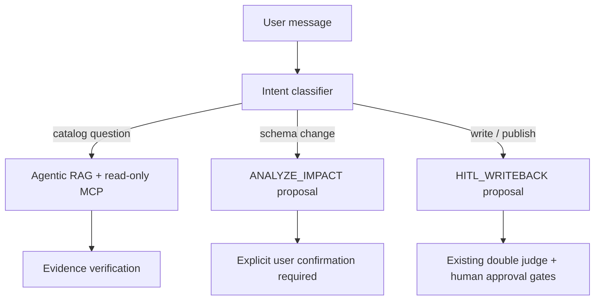

# Agentic RAG + DataHub MCP

LineageGuard does not treat vector retrieval as proof. Qdrant narrows the search space; DataHub MCP supplies the live, authoritative evidence required for factual schema and lineage answers.

## Design goals

1. Answer useful catalog questions from a bounded metadata index.
2. Verify DataHub claims against live MCP reads.
3. Resolve and lock the intended asset before a schema or lineage tool call.
4. Refuse safely when no target or proof exists.
5. Route requested changes to the existing governed workflow rather than executing them from chat.

## What is indexed

Each Qdrant point is a metadata projection containing:

- DataHub URN
- display label
- entity type
- platform URN
- owner URNs

The index never stores table rows, SQL statements, credentials, tokens, raw GraphQL payloads, private chain-of-thought, or DataHub mutation permissions. It is a retrieval aid only.

## Ingestion lifecycle

```mermaid
flowchart LR
    Start["User starts indexing"] --> Catalog["Read bounded DataHub catalog"]
    Catalog --> Project["Create safe metadata projection"]
    Project --> Embed["Embed or local-hash projection"]
    Embed --> Stage["Build isolated snapshot collection"]
    Stage --> Validate["Validate exact unique point count"]
    Validate --> Swap["Atomically switch active alias"]
    Swap --> Cleanup["Delete superseded snapshot"]
    Cleanup --> Ready["Stale-free index completed"]
```



The API never starts ingestion automatically. A user starts it from the UI or `POST /api/v1/chat/index/ingest`. Each run writes deterministic IDs into an isolated collection, validates the exact unique point count, then atomically switches the `QDRANT_COLLECTION__active` alias. The previous snapshot remains queryable during the rebuild and is deleted only after the switch. Therefore assets removed from DataHub cannot remain searchable as stale records. An empty, incomplete, or failed rebuild preserves the last good index.

If a Qdrant collection already exists, `query_available=true` remains true during a refresh. The UI labels this `CHAT READY · INDEXING`; retrieval and MCP verification keep using the existing collection while the index is rebuilt.

## Target resolution

Before schema, lineage, or impact analysis, the tool manager resolves a target with these rules:

| User signal | Resolution rule |
|---|---|
| Explicit DataHub URN | Use that URN directly after live validation |
| Platform plus name, e.g. “Snowflake orders” | Select only an exact matching URN on that platform |
| Pronoun, e.g. “its schema” | Use only the last non-ambiguous MCP-verified session target |
| General catalog request | Multiple matches may be listed |
| Ambiguous schema or lineage request | Ask the user for a platform; never select an arbitrary `orders` asset |
| Nonexistent asset | Return `NOT_FOUND`; do not call schema or lineage tools on a similar real asset |

Once an MCP match resolves a single target, retries are locked to that URN. A Qdrant-only result can never be promoted to a schema or lineage target. When primary live search is insufficient, Qdrant may guide up to three additional label searches (configurable). For schema intent, a `SCHEMAFIELD` result is safely projected to the parent dataset URN already encoded in its URN, with parent duplicates removed. A candidate becomes eligible only if live MCP returns that exact dataset URN. Stale or weak candidates are discarded; close scores stay ambiguous, and multiple exact-name assets remain ambiguous regardless of vector rank.

## Verification rules

| Question type | Required live evidence |
|---|---|
| General catalog answer | At least one relevant MCP search evidence record |
| Schema answer | `list_schema_fields` evidence belonging to the resolved target URN and cited in the answer |
| Lineage answer | `get_lineage` evidence belonging to the resolved target URN and cited in the answer |
| Change request | A resolved target before `ANALYZE_IMPACT` is proposed |
| Write request | `HITL_WRITEBACK` proposal only; chat has no write tool |

The verifier performs at most one bounded retry. If requirements still fail, it returns a safe limitation with status `LIMITED`. `COMPLETED` in a raw stage trace only means that a stage ran; the user-facing outcome is `VERIFIED`, `LIMITED`, or `ACTION_REQUIRED`.

Verification is claim-level, not citation-presence-only. The response is split into public factual assertions and each assertion must:

- name at least one existing live MCP evidence ID;
- use schema or lineage evidence owned by the locked target URN;
- contain factual anchors present in that evidence (asset/field/type/relationship identifiers and counts);
- avoid unsupported absence or negation claims; and
- pass independently from every other sentence in the response.

The API exposes `factual_claim_count`, `supported_claim_count`, `claim_coverage`, and a public reason per claim. Any unsupported claim makes the response fail closed after the bounded retry. Qdrant citations are candidate context and can never prove a factual claim.

## Conversation memory

Memory is a local SQLite feature for conversational continuity, not a source of truth.

- Browser generates a random session ID without an account identity.
- The default limit is six final question/answer turns.
- Retention defaults to seven days and can be disabled per request.
- **Clear memory** immediately removes retained turns for that session.
- A separate active-asset record is saved only for one non-ambiguous MCP-verified asset.
- Memory content cannot authorize a tool call and cannot satisfy verification.

For professional independent tests, use a new session or clear memory before each scenario. For normal product use, the six-turn limit is useful for follow-ups such as “What is its schema?”.

## Action router



The chat can launch only a confirmed **read-only** impact analysis. It cannot bypass Gate 0, independent judges, the feature flag, or human approval.

For an impact request, the verified target is transferred with a 15-minute
server-owned handoff bound to the browser session and exact MCP-resolved URN.
The user completes the change type and column contract in the analysis form;
the frontend never silently executes its default form values. Expired,
cross-session, ambiguous, or asset-substituted handoffs fail closed. Starting a
new target resolution or clearing conversation memory revokes the prior
handoff.

## Bounded provider latency

Chat-path embeddings, adaptive planning, final answer generation, and each
live MCP read independently use `CHAT_TIMEOUT_SECONDS` (15 seconds by
default). If Qdrant query embedding is unavailable, the agent continues with
live MCP only. If a planning or answer call fails, deterministic intent
extraction or a bounded summary retains the original MCP evidence IDs. An MCP
timeout returns a safe limitation and cannot create a target handoff.
Verification still applies normally. The public trace labels these paths
`LIMITED`, `deterministic_fallback`, or `deterministic_evidence_fallback`; a
fallback is never presented as a model-generated response.

## Configuration

```env
QDRANT_URL=http://qdrant:6333
QDRANT_COLLECTION=lineageguard_datahub
RAG_EMBEDDING_PROVIDER=openai
RAG_EMBEDDING_MODEL=text-embedding-3-small
RAG_MAX_ASSETS=1500
RAG_MCP_CONFIRMATION_CANDIDATES=3
RAG_MCP_CONFIRMATION_MIN_SCORE=0.40
RAG_MCP_CONFIRMATION_MIN_MARGIN=0.05

OPENAI_API_KEY=
OPENAI_CHAT_MODEL=gpt-4.1-mini

CHAT_MEMORY_ENABLED=true
CHAT_MEMORY_MAX_TURNS=6
CHAT_MEMORY_CONTEXT_CHARS=6000
CHAT_MEMORY_TTL_HOURS=168
```

For a local no-key demonstration:

```env
DEMO_MODE=true
RAG_EMBEDDING_PROVIDER=local_hash
```

`local_hash` permits functional workflow testing but is not a semantic embedding benchmark.

## Evaluation

The offline runner measures retrieval precision/recall, MRR, NDCG, schema exact match, tool routing, citation coverage, verifier blocking, latency, and estimated cost without provider calls:

```powershell
python .\evals\runners\run_agentic_rag_evals.py
```

The live runner sends read-only requests to the local API and records model telemetry plus claim-support coverage, unsupported-claim escape rate, and fully-supported verified-answer rate. It requires a manually reviewed ground truth before metrics are presented as quality results:

```powershell
python .\evals\runners\run_live_agentic_evals.py --api-base-url http://localhost:8000
```

See the [acceptance plan](acceptance-test-plan.md) for the required professional test matrix and [evaluation assets](../evals/README.md) for metric definitions and limitations.
