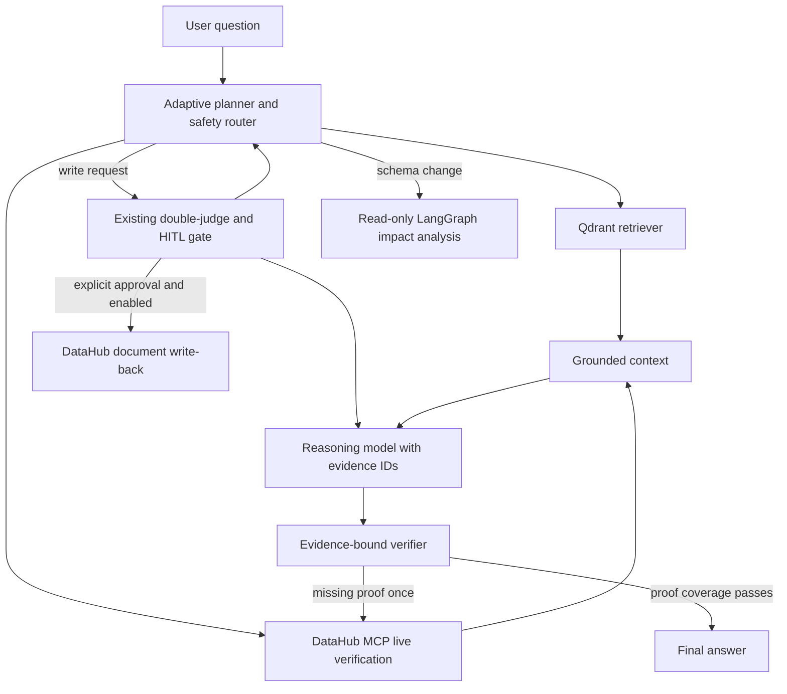

# Agentic RAG + DataHub MCP

The assistant is a read-only, evidence-bound interface over the local DataHub
catalog. It implements the following bounded architecture:



## What is stored

The controlled ingestion job stores only a small metadata projection: asset URN,
label, entity type, platform and owner URNs. It does **not** copy table rows,
SQL, secrets, GraphQL payloads or credentials into Qdrant. Vector retrieval is
only a convenience layer; every answer also runs a current DataHub MCP search.

Qdrant does **not** replace DataHub or mirror every aspect. With the showcase
catalog, the controlled job indexed 1,188 discoverable assets in one local
run. Their current
schemas, lineage paths, ownership and other aspects remain in DataHub and are
read on demand through MCP. This keeps the vector database small and avoids
stale copies of operational metadata.

## Conversation memory

The chat has bounded, per-browser-session memory for follow-up questions such
as “and what is its schema?”. It is stored locally in the application SQLite
volume, not in Qdrant and not in DataHub.

- The browser creates a random session identifier; it contains no account or personal identity.
- At most `CHAT_MEMORY_MAX_TURNS` final question/answer pairs are retained.
- Memory expires after `CHAT_MEMORY_TTL_HOURS` (seven days by default) and can
  be erased immediately with **Effacer la mémoire** in the UI.
- No API keys, raw MCP payloads, chain-of-thought, credentials, mutation
  approvals or tool authority are stored.
- Memory is context only: every DataHub claim still requires fresh MCP evidence
  and the standard verification pass.

Set `CHAT_MEMORY_ENABLED=false` to disable reading and recording. The user can
also untick the memory control before sending a question.

## Executable agent graph

This is not a single retrieve-and-answer call. Each chat request runs a
LangGraph state graph with an auditable public trace:

1. **Planning agent** creates a compact JSON plan with a configured chat model
   when one is available. It falls back visibly to deterministic keyword
   classification only in no-key/demo mode.
2. **RAG retriever** finds relevant metadata records in Qdrant.
3. **MCP tool manager** runs DataHub `search` and, where relevant,
   `list_schema_fields` and/or `get_lineage`. It converts tool output into
   evidence records: exact schema field/type facts and observed lineage edges.
   The MCP allowlist remains fixed.
4. **Reasoning agent** creates a grounded answer from the RAG candidates and
   live MCP facts. Schema and lineage assertions must cite evidence IDs such as
   `[E-schema-…]`; it cannot execute tools or mutate DataHub.
5. **Verification agent** checks evidence presence, required schema/lineage
   coverage and evidence-ID citations. It retries bounded read-only MCP tools
   once, then returns a safe limitation instead of an unsupported conclusion.
6. **Action router** either returns the answer, offers the read-only impact
   workflow, or directs a write request to the separate HITL gate.

The UI renders these five completed stages after each answer. It never shows
private chain-of-thought, only the public actions and evidence used.

## Starting the index

1. Start DataHub, load the desired datapack, then start LineageGuard with Docker.
2. In the UI, use **Indexer les metadonnees DataHub** and wait for `COMPLETED`.
3. Ask a catalog or lineage question. Citations identify whether an item came
   from Qdrant or was verified live through MCP.

The initial embedding pass uses the configured embedding provider and may incur
provider cost. It is deliberately manual and is never started by Docker, tests,
or a page refresh. Re-running it upserts deterministic IDs, so it does not
duplicate indexed assets. `DEMO_MODE=true` with
`RAG_EMBEDDING_PROVIDER=local_hash` uses a deterministic local hash embedding
for no-key demonstrations; it is intentionally not presented as semantic RAG.

## Safety router

- A normal question returns an answer with sources and performs no action.
- A request that looks like a schema change proposes the existing **read-only**
  LangGraph analysis. The user must explicitly confirm it and fill the normal
  change-request form.
- A request to publish, save or write proposes the existing HITL process only.
  The chat has no DataHub write tool and cannot bypass double independent judges,
  write-back configuration, or human approval.

## Evaluation and metrics

The offline evaluation suite includes deterministic tests for the complete
agent trace, hybrid source merging, schema evidence injection, evidence-bound
verification, schema-change routing, and HITL write routing. Run it with:

```powershell
Set-Location backend
python -m pytest tests -q -p no:cacheprovider
```

Run the reproducible Agentic RAG fixture metrics without changing tracked
reports:

```powershell
python evals/runners/run_agentic_rag_evals.py
```

It measures asset and lineage precision/recall, schema exact match, tool
selection accuracy, evidence citation coverage, unsupported-claim rate before
and after the verifier, verification block rate, p95 latency, and estimated
cost. The committed result is an **offline fixture baseline**, not a live model
quality claim. Use `--write-report` only when deliberately refreshing it.

For an explicitly approved local DataHub write proof, see
[`live-writeback-proof.md`](live-writeback-proof.md). It creates and then
supersedes one Analysis document and is skipped unless two confirmation
environment variables are set.

## Configuration

```env
QDRANT_URL=http://qdrant:6333
QDRANT_COLLECTION=lineageguard_datahub
RAG_EMBEDDING_MODEL=text-embedding-3-small
RAG_EMBEDDING_PROVIDER=openai
DEMO_MODE=false
RAG_MAX_ASSETS=1500
OPENAI_CHAT_MODEL=gpt-4.1-mini
CHAT_MEMORY_ENABLED=true
CHAT_MEMORY_MAX_TURNS=6
CHAT_MEMORY_CONTEXT_CHARS=6000
CHAT_MEMORY_TTL_HOURS=168
```

`QDRANT_URL` points to the Compose service by default. For a backend run outside
Docker, use `http://localhost:6333`. Keep `.env` private: it is ignored by Git.
