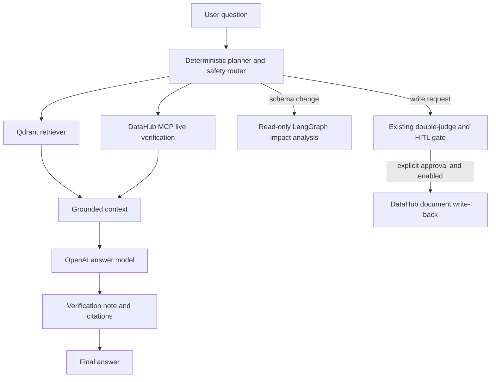

# Agentic RAG + DataHub MCP

The assistant is a read-only, grounded interface over the local DataHub
catalog. It implements the following bounded architecture:



## What is stored

The controlled ingestion job stores only a small metadata projection: asset URN,
label, entity type, platform and owner URNs. It does **not** copy table rows,
SQL, secrets, GraphQL payloads or credentials into Qdrant. Vector retrieval is
only a convenience layer; every answer also runs a current DataHub MCP search.

Qdrant does **not** replace DataHub or mirror every aspect. With the showcase
catalog, the controlled job indexed 1,188 discoverable assets. Their current
schemas, lineage paths, ownership and other aspects remain in DataHub and are
read on demand through MCP. This keeps the vector database small and avoids
stale copies of operational metadata.

## Executable agent graph

This is not a single retrieve-and-answer call. Each chat request runs a
LangGraph state graph with an auditable public trace:

1. **Planning agent** classifies the question and selects only allowed
   read-only operations.
2. **RAG retriever** finds relevant metadata records in Qdrant.
3. **MCP tool manager** runs DataHub `search` and, where relevant,
   `list_schema_fields` and/or `get_lineage`. The MCP allowlist remains fixed.
4. **Reasoning agent** creates a grounded answer from the RAG and live MCP
   citations. It cannot execute tools or mutate DataHub.
5. **Verification agent** checks that the returned answer has citations and
   clearly states whether live MCP found a direct match.
6. **Action router** either returns the answer, offers the read-only impact
   workflow, or directs a write request to the separate HITL gate.

The UI renders these five completed stages after each answer. It never shows
private chain-of-thought, only the public actions and evidence used.

## Starting the index

1. Start DataHub, load the desired datapack, then start LineageGuard with Docker.
2. In the UI, use **Indexer les metadonnees DataHub** and wait for `COMPLETED`.
3. Ask a catalog or lineage question. Citations identify whether an item came
   from Qdrant or was verified live through MCP.

The initial embedding pass uses the configured embedding provider and may incur
provider cost. It is deliberately manual and is never started by Docker, tests,
or a page refresh. Re-running it upserts deterministic IDs, so it does not
duplicate indexed assets.

## Safety router

- A normal question returns an answer with sources and performs no action.
- A request that looks like a schema change proposes the existing **read-only**
  LangGraph analysis. The user must explicitly confirm it and fill the normal
  change-request form.
- A request to publish, save or write proposes the existing HITL process only.
  The chat has no DataHub write tool and cannot bypass double independent judges,
  write-back configuration, or human approval.

## Evaluation

The offline evaluation suite includes deterministic tests for the complete
agent trace, hybrid source merging, schema-tool routing, schema-change routing,
and HITL write routing. Run it with:

```powershell
Set-Location backend
python -m pytest tests -q -p no:cacheprovider
```

The current suite passes 46 tests, with 3 optional local integration tests
skipped when their external services are not part of the test command. The
frontend production check is `npm run check` from `frontend`.

## Configuration

```env
QDRANT_URL=http://qdrant:6333
QDRANT_COLLECTION=lineageguard_datahub
RAG_EMBEDDING_MODEL=text-embedding-3-small
RAG_MAX_ASSETS=1500
OPENAI_CHAT_MODEL=gpt-4.1-mini
```

`QDRANT_URL` points to the Compose service by default. For a backend run outside
Docker, use `http://localhost:6333`. Keep `.env` private: it is ignored by Git.
