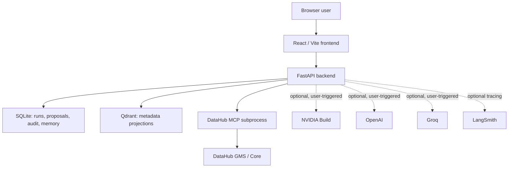
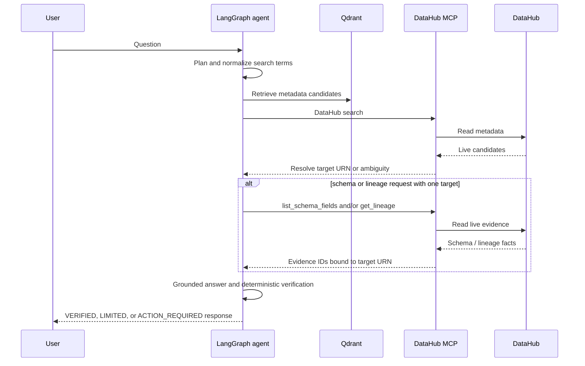

# Architecture

This document describes the implementation that is present in this repository. It distinguishes demonstrated behaviour from optional integrations and does not treat configuration as proof of a successful provider call.

## System context

The browser talks only to the FastAPI API. It never receives a DataHub token, a provider key, raw MCP server environment, or a write-capable MCP client.

## Main workflows

### Governed impact workflow

```mermaid
flowchart LR
    Request["Validated change request"] --> Read["DataHub schema + lineage reads"]
    Read --> Report["Evidence-backed impact report"]
    Report --> Plan["Deterministic remediation plan"]
    Plan --> Snapshot["Persist server-owned analysis_run_id"]
    Plan -. "optional advisory" .-> Critic["NVIDIA critique"]
    Snapshot --> Gate0{"Gate 0 reconstruction"}
    Gate0 -->|"invalid"| Stop["Blocked: no provider call"]
    Gate0 -->|"valid and requested"| J1["OpenAI factual judge"]
    Gate0 -->|"valid and requested"| J2["Groq technical/safety judge"]
    J1 --> Aggregate["Deterministic aggregation"]
    J2 --> Aggregate
    Aggregate -->|"double threshold PASS"| Proposal["Prepare HITL proposal"]
    Aggregate -->|"otherwise"| Review["Repair or human review"]
    Proposal --> Human{"Human decision"}
    Human -->|"approve + enabled"| Save["DataHub Analysis document only"]
    Human -->|"reject / revise"| Audit["Persist audit event"]
```

### Agentic RAG workflow

## Data classification

| Store / channel | Contents | Does not contain |
|---|---|---|
| DataHub | The authoritative metadata graph | Application credentials or LineageGuard approval records |
| Qdrant | URN, label, type, platform URN, owners | Table rows, SQL, raw GraphQL payloads, credentials, model prompts |
| SQLite | Workflow state, audit, proposal/snapshot, local conversation memory | Provider secrets, DataHub token, private chain-of-thought |
| Browser local storage | Random anonymous chat session identifier | Memory content, DataHub token, provider keys |
| LangSmith, if enabled | Trace hierarchy and configured run telemetry | Keys; public evidence must be reviewed before export |

## Agent responsibilities and invariants

| Agent / component | Input | Output | Invariant |
|---|---|---|---|
| Planning agent | User question and bounded non-evidence memory | Search terms and tool needs | Normalizes conversational words and cannot call tools |
| Qdrant retriever | Question | Candidate metadata | Candidates are not accepted as factual evidence |
| Target resolver | MCP search matches + active verified asset | `RESOLVED`, `AMBIGUOUS`, `NOT_FOUND`, or `NOT_REQUIRED` | Schema/lineage needs a single target; a platform is requested when ambiguous |
| MCP tool manager | Locked target and plan | Read-only evidence records | Retries retain the same target; unknown assets never trigger unrelated schema or lineage reads |
| Reasoning agent | Candidate sources and named evidence | Draft answer | Schema and lineage claims must cite an evidence ID |
| Verification agent | Draft answer, evidence, target | Verified response or safe limitation | Evidence must belong to the resolved target URN |
| Action router | User intent | `NONE`, `ANALYZE_IMPACT`, or `HITL_WRITEBACK` | The chat cannot perform a mutation |

## 3D catalog cache lifecycle

```mermaid
stateDiagram-v2
    [*] --> RUNNING: backend starts
    RUNNING --> READY: root catalog assets loaded
    READY --> READY: enrich lineage relationships in background
    READY --> STALE: manual refresh or LineageGuard action
    STALE --> RUNNING: refresh begins; old graph remains visible
    RUNNING --> READY: atomically replace complete refreshed graph
    RUNNING --> FAILED: initial DataHub failure
    STALE --> STALE: refresh fails; old graph remains visible
```

The API maintains an in-memory root-URN fingerprint separate from the enriched graph. Scheduled polling does not scan lineage again when the root URN set is unchanged. It requires two equal changed observations before refreshing, preventing transient DataHub search ordering or display metadata changes from causing expensive repeated scans.

## Operational limits

| Limit | Default | Reason |
|---|---:|---|
| Catalog assets | 1,500 | Bounds startup and graph rendering work |
| Catalog edges | 5,000 | Bounds browser and cache memory |
| Catalog poll | 60 seconds | Detects external changes without a webhook |
| RAG assets | 1,500 | Bounds Qdrant ingestion |
| Memory turns | 6 | Keeps contextual carry-over small and auditable |
| Tool retry | 1 bounded retry | Allows recovery without target substitution or loops |
| Judge retries | Environment-controlled | Avoids uncontrolled external cost |

## Observability

LangGraph emits its own graph trace when LangSmith is enabled. The implementation also names the outer RAG request and optional provider operations so latency and failures can be filtered by component. Public UI traces show only stage names, status, selected target, tool actions, and verification notes; they intentionally do not display private reasoning.
