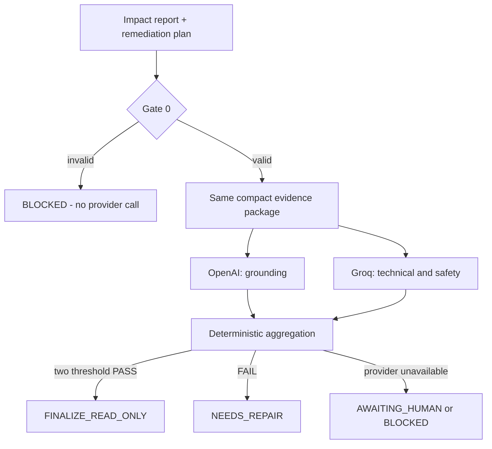

# Double jugement indépendant

`POST /api/v1/judges/evaluate` reçoit un rapport d'impact et un plan de remédiation. Il applique Gate 0 avant tout appel externe, puis lance OpenAI et Groq indépendamment et en concurrence.

## Gate 0

Gate 0 refuse le dossier si l'un des invariants suivants échoue :

- chaque actif impacté référence des preuves présentes ;
- les URN et chemins de lineage sont cohérents avec l'actif source ;
- la colonne demandée est soutenue par les preuves de schéma lorsque nécessaire ;
- le score de risque correspond au recalcul déterministe ;
- le plan et le rollback déclarent `NOT_EXECUTED`.

Si Gate 0 échoue, aucun fournisseur externe n'est appelé.

## Paquet envoyé aux juges

Les deux juges reçoivent exactement le même dossier compact : demande, score et formule, actifs/chemins de lineage, index de preuves, limites de métadonnées, plan et rollback. Les réponses GraphQL brutes sont exclues afin de réduire la surface d'injection et les dépassements de quota. Le rapport complet reste persistant côté serveur pour la revue humaine.

OpenAI se concentre sur le grounding factuel ; Groq se concentre sur la correction technique et la sécurité. Aucun juge n'a un outil DataHub ou une permission d'écriture, et aucun ne reçoit le verdict de l'autre.



## Configuration

Conserver les secrets dans `.env` seulement :

```env
OPENAI_API_KEY=...
OPENAI_JUDGE_MODEL=gpt-4.1-mini
GROQ_API_KEY=...
GROQ_JUDGE_MODEL=openai/gpt-oss-20b
JUDGE_TEMPERATURE=0
JUDGE_TIMEOUT_SECONDS=60
JUDGE_MAX_RETRIES=1
```

Groq utilise un JSON Schema strict avec les champs `verdict`, `scores`, `critical_errors`, `non_critical_issues`, `repair_instructions`, `audit_rationale` et `confidence`. Cette contrainte réduit les sorties JSON invalides. OpenAI et Groq doivent tous deux franchir les seuils ; une réponse simplement syntaxiquement valide ne suffit pas.

## Justification auditable, pas chaîne de pensée

Chaque verdict comporte `audit_rationale`, une courte liste de justifications observables. Ces lignes peuvent référencer les identifiants de preuve, les limites ou les conditions du plan. Les chaînes de pensée privées, traces de raisonnement détaillées et contenus cachés des fournisseurs ne sont ni demandés, ni affichés, ni persistés.

## Politique d'agrégation

| Résultat | Décision |
|---|---|
| Deux PASS aux seuils | `FINALIZE_READ_ONLY` |
| Au moins un FAIL avant la limite de cycles | `NEEDS_REPAIR` |
| Limite de deux cycles atteinte sans double PASS | `AWAITING_HUMAN` |
| Un juge `ERROR` ou `TIMEOUT` | `AWAITING_HUMAN` |
| Deux juges indisponibles | `BLOCKED` |

Un résultat `FAIL` ou `NEEDS_REPAIR` est une information de sécurité utile. Il ne faut pas remplacer un juge pour rendre le verdict artificiellement favorable.
