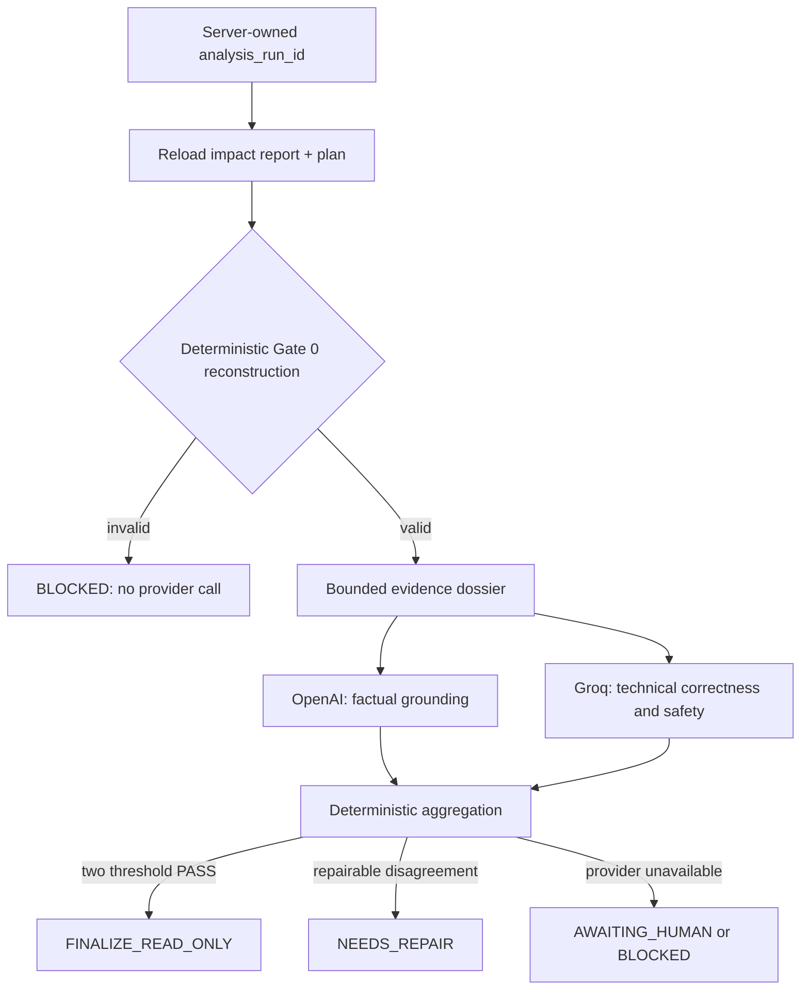

# Independent judging

The review stage is a safety control, not an automatic approval mechanism. It evaluates a deterministic impact report and remediation plan after DataHub reads have already completed.

## Gate 0

Gate 0 is deterministic and runs before any external provider is constructed or
called. The browser submits only the `analysis_run_id`; the backend reloads the
impact report and plan from its server-owned SQLite snapshot. Gate 0 then blocks
the request when any of these invariants fail:

- evidence IDs are unique and every impacted asset references target-owned
  lineage evidence;
- source URN, destination URN, lineage summary, blast radius, and lineage paths
  are internally consistent;
- required schema evidence supports the requested column or change;
- missing-metadata facts are reconstructed from observed owners, platforms, and
  the structured lineage total;
- every risk component, score, level, explanation, and confidence value matches
  an independent deterministic reconstruction;
- remediation steps and tests cannot introduce assets outside the observed
  report;
- remediation and rollback plans both declare `NOT_EXECUTED`.

If Gate 0 fails, OpenAI and Groq are not called. NVIDIA remains a separate,
manually triggered advisory stage and cannot approve the report.

## Review flow



Both judges receive the same compact dossier: request, risk assessment, bounded
impacts, schema and lineage-summary evidence, missing-metadata counts/samples,
and the remediation/rollback plan. Repeated paths and target URN lists are
represented once through reconstructible target scopes (`SOURCE_ASSET`,
`ALL_IMPACTED_ASSETS`, or `SOURCE_AND_ALL_IMPACTED_ASSETS`). Raw DataHub GraphQL
responses are excluded to reduce cost, prompt-injection surface, and context
overflow. Neither judge receives the other judge's verdict or has a DataHub
tool.

## Provider behaviour

| Provider | Role | Structured output handling |
|---|---|---|
| NVIDIA Build | Advisory critique only | Bounded JSON response; timeout surfaces as an advisory failure and never changes a plan |
| OpenAI | Factual-grounding judge | JSON verdict parsed against the required contract |
| Groq | Technical/safety judge | JSON Schema is attempted first; JSON-object fallback is used only if structured mode is rejected, then the same strict parser and pass thresholds apply. GPT-OSS uses low, hidden reasoning and a bounded 1,200-token verdict budget. |

The Groq fallback does **not** convert an unavailable judge into a PASS. Timeouts, malformed content after retries, and provider errors return an unavailable verdict and force human review or block the run according to the aggregation table.

Provider diagnostics log only exception type, HTTP status, and provider error
code. Prompts, metadata, response bodies, and credentials are never logged.

## Live acceptance proof

The hardened path was exercised against the local DataHub catalog with a
read-only `DROP_COLUMN` analysis for the Snowflake `orders.order_status` field:

- deterministic Gate 0: `PASS`;
- OpenAI `gpt-4.1-mini`: `PASS`;
- Groq `openai/gpt-oss-20b`: `PASS`;
- aggregate decision: `FINALIZE_READ_ONLY`;
- write-back proposals and audit events for the judging run: `0`.

This acceptance result proves the read/analyze/judge path only. It does not
claim that a DataHub mutation was executed.

## Pass threshold and aggregation

A judge must return `PASS`, no critical errors, `grounding >= 4`, `technical_correctness >= 4`, `safety >= 4`, average score `>= 4`, and confidence `>= 0.75`.

| Result | Aggregate decision |
|---|---|
| Both independent judges meet threshold | `FINALIZE_READ_ONLY` |
| At least one valid FAIL and repair cycles remain | `NEEDS_REPAIR` |
| Repair-cycle limit reached | `AWAITING_HUMAN` |
| One judge unavailable | `AWAITING_HUMAN` |
| Both judges unavailable | `BLOCKED` |

`FINALIZE_READ_ONLY` permits preparation of an HITL proposal only. It never writes to DataHub by itself.

## Auditable rationale, not chain-of-thought

Judge responses expose concise `audit_rationale`, critical errors, non-critical issues, repair instructions, scores, and confidence. These are observable review reasons and may cite evidence IDs. Private chain-of-thought and hidden provider reasoning are never requested, stored, or shown in the UI.

## Configuration

```env
OPENAI_API_KEY=
OPENAI_JUDGE_MODEL=gpt-4.1-mini
GROQ_API_KEY=
GROQ_JUDGE_MODEL=openai/gpt-oss-20b
JUDGE_TEMPERATURE=0
JUDGE_TIMEOUT_SECONDS=60
JUDGE_MAX_RETRIES=1

NVIDIA_API_KEY=
NVIDIA_BASE_URL=https://integrate.api.nvidia.com/v1
NVIDIA_CRITIC_MODEL=nvidia/nemotron-3-nano-30b-a3b
NVIDIA_TIMEOUT_SECONDS=90
```

Choose only models available to the corresponding account. A changed model is a material evaluation change: record it beside every benchmark result and do not compare its score directly with a previous model without disclosure.

The NVIDIA critic is advisory and is intentionally distinct from the worker.
Its response is streamed with reasoning disabled, normalized conservatively,
restricted to evidence IDs present in the dossier, and validated by Pydantic.
One schema-only repair may run within the original total timeout. A timeout or
invalid response never changes the deterministic remediation plan.
