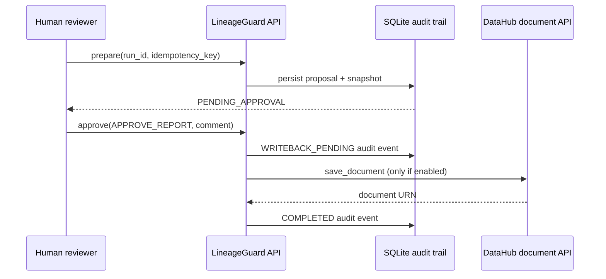

# HITL write-back

Write-back is disabled by default. Set `DATAHUB_WRITEBACK_ENABLED=true` only after reviewing a prepared proposal and its snapshot.

The only supported mutation is `save_document`, used to publish an approved analysis report related to its source asset. A proposal requires Gate 0 and double PASS, plus an idempotency key. `APPROVE_REPORT` is required before the mutation; `APPROVE_ROLLBACK` is separately required to compensate it. Compensation updates only the document created by that run, marking it superseded.

Judging runs, write-back proposals, snapshots, state transitions, and audit events are persisted in the MVP SQLite database. The Docker deployment stores this database in the `lineageguard-backend-data` volume, so a backend restart does not discard an approval trail.

The approval API is deliberately narrow:

- `POST /api/v1/writebacks/prepare` accepts only a server-owned judging `run_id` and an idempotency key;
- `GET /api/v1/writebacks/{run_id}` retrieves the prepared proposal and snapshot;
- `GET /api/v1/writebacks/{run_id}/audit` retrieves the immutable ordered audit trail;
- `POST /api/v1/writebacks/{run_id}/approve` requires `APPROVE_REPORT` or `REJECT`;
- `POST /api/v1/writebacks/{run_id}/rollback` requires a completed write-back and `APPROVE_ROLLBACK`.

The service persists `WRITEBACK_PENDING` before invoking DataHub and records `FAILED` if that invocation fails. Repeating an approved request with the same idempotency key cannot create a second document.

## Operational sequence

Keep `DATAHUB_WRITEBACK_ENABLED=false` for the normal hackathon demonstration. Setting it to `true` is a sensitive configuration change: rebuild or recreate the backend, inspect the proposal and snapshot, and approve from the UI only after an explicit human decision.
