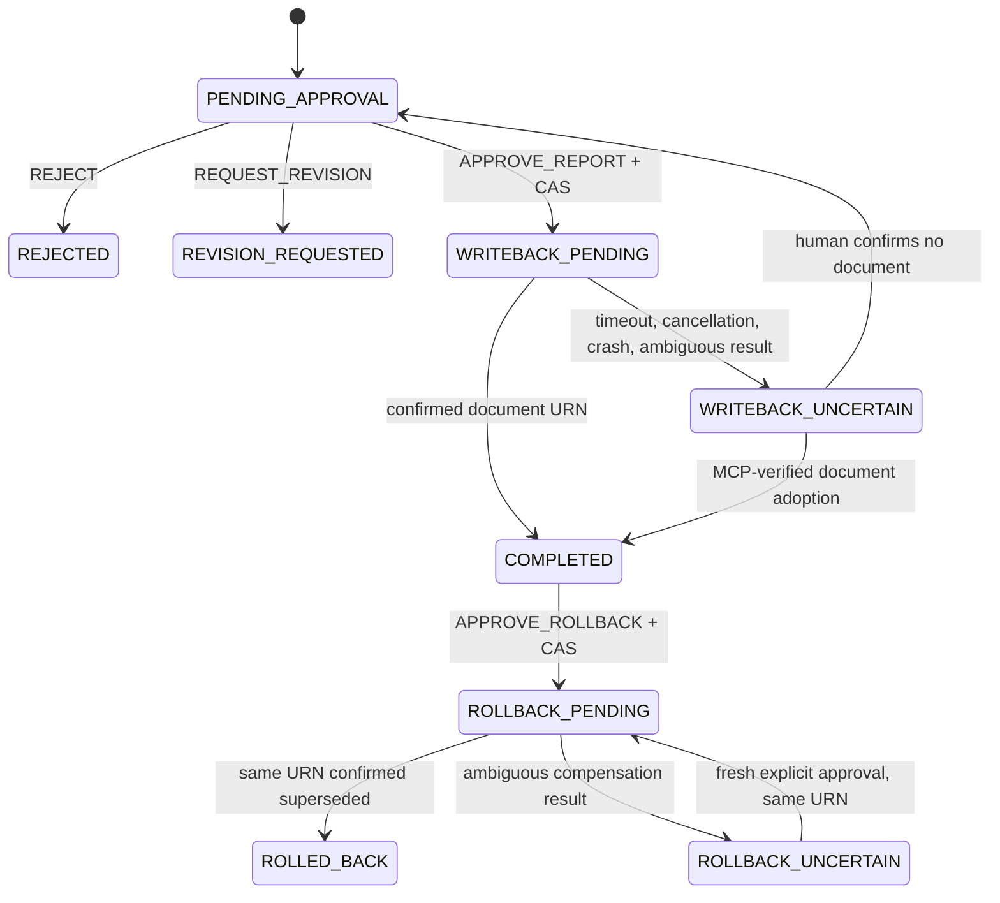

# Secure HITL write-back

Write-back is disabled by default. Set `DATAHUB_WRITEBACK_ENABLED=true` only
for a reviewed operation in a disposable or controlled DataHub environment.
LineageGuard's sole mutation is `save_document` for one DataHub Analysis
document related to the analyzed asset. It cannot alter schemas, lineage,
datasets, dashboards, warehouse rows, or dbt jobs.

## Security invariants

- Gate 0 and both independent judges must PASS before proposal preparation.
- `APPROVE_REPORT` and `APPROVE_ROLLBACK` are separate human decisions.
- The browser generates and retains the idempotency key; API responses never
  disclose it.
- A key is permanently bound to one report hash, and one report cannot be
  prepared under multiple keys.
- SQLite `BEGIN IMMEDIATE` transactions perform cross-thread and cross-process
  compare-and-swap transitions before any MCP mutation.
- Only the request that claims `WRITEBACK_PENDING` may call `save_document`.
  Concurrent or repeated approvals cannot call the writer twice.
- A persisted operation ID owns each in-flight transition and its audit events.
- Audit events and state changes commit in the same local transaction.

This provides **at-most-once automatic create attempts**, not a dishonest claim
of distributed exactly-once delivery. DataHub MCP does not provide a remote
idempotency key for document creation. If the connection fails after DataHub may
have accepted a write, the correct result is therefore uncertainty, not retry.

## Failure and recovery policy

| Situation | Durable status | Automatic behavior | Required action |
|---|---|---|---|
| Concurrent approval | `WRITEBACK_PENDING` or `COMPLETED` | No second write | Wait/read current proposal |
| Create response is lost | `WRITEBACK_UNCERTAIN` | Create retry is blocked | Reconcile in DataHub |
| Backend dies in-flight | `WRITEBACK_UNCERTAIN` after `WRITEBACK_STALE_SECONDS` | Retry remains blocked | Reconcile in DataHub |
| Exact created document is found | `COMPLETED` | None | Adopt only after live MCP identity verification |
| Reviewer confirms no document exists | `PENDING_APPROVAL` | None | A fresh explicit approval may retry |
| Compensation response is lost | `ROLLBACK_UNCERTAIN` | No automatic retry | Explicitly approve retry on the same known URN |
| Compensation succeeds | `ROLLED_BACK` | None | Preserve audit trail |

Adoption is not based on an operator-provided URN alone. The service reads the
candidate through MCP and requires the exact proposal title and related asset.
This prevents an unrelated DataHub document from being adopted or later
superseded.

Compensation never deletes a document. It writes superseded content to the
exact URN persisted by the completed proposal. A retry from
`ROLLBACK_UNCERTAIN` is idempotent in business effect because it is restricted
to that same URN.

## Durable state machine

## API sequence

1. `POST /api/v1/writebacks/prepare` with a server-owned judging `run_id` and
   browser-held idempotency key.
2. Review `GET /api/v1/writebacks/{run_id}` and its immutable report snapshot.
3. Review `GET /api/v1/writebacks/{run_id}/audit`.
4. Send `APPROVE_REPORT`, `REQUEST_REVISION`, or `REJECT` to
   `POST /api/v1/writebacks/{run_id}/approve`.
5. If the create outcome becomes uncertain, inspect DataHub and use
   `POST /api/v1/writebacks/{run_id}/reconcile`.
6. A completed document can be compensated only through
   `POST /api/v1/writebacks/{run_id}/rollback` with `APPROVE_ROLLBACK`.

`WRITEBACK_STALE_SECONDS` defaults to `300` and has a minimum of 30 seconds.
It controls only when abandoned local in-flight work becomes uncertain. It
never authorizes an external retry.

## Operational limits

SQLite is appropriate for this single-node hackathon deployment and safely
serializes local competing requests. A multi-replica production deployment
should move the same compare-and-swap state machine to a managed transactional
database, add authenticated reviewer identities/RBAC, and use a provider-native
idempotency token if DataHub exposes one in the future.
