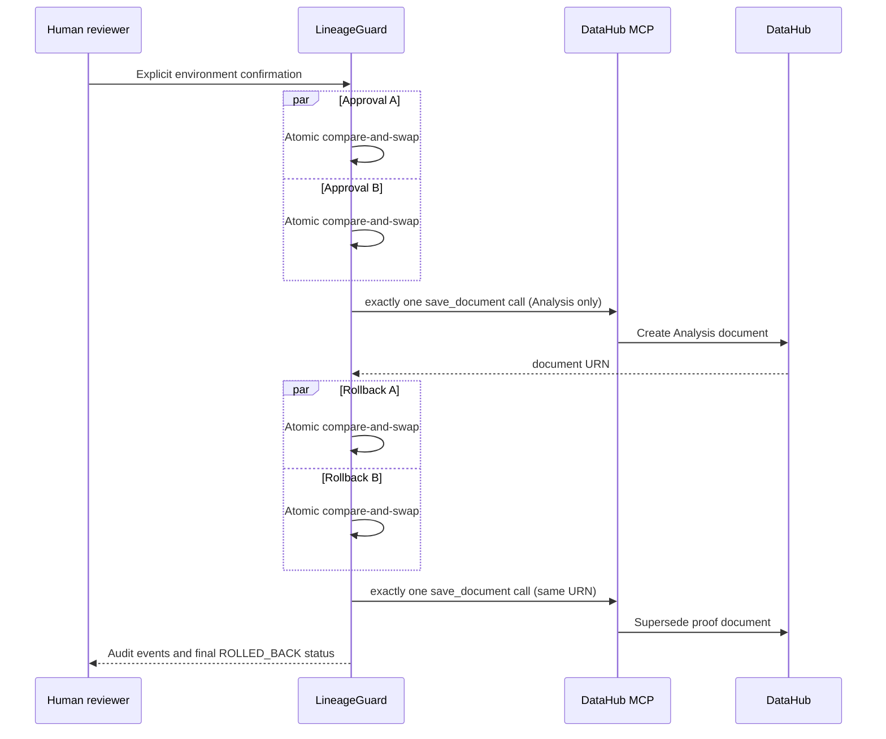

# Live DataHub write-back proof

The default application is read-only. The only permitted mutation is an
approved **DataHub Analysis document**; LineageGuard never changes a warehouse
schema, dataset, lineage edge, dbt model, or BI dashboard.

This repository contains an opt-in integration proof at
`backend/tests/integration/test_live_writeback_proof.py`. It performs the
following auditable sequence against a disposable/local DataHub environment:



## Preconditions

1. Start the local DataHub Quickstart and LineageGuard services.
2. Ensure the catalog contains at least one dataset.
3. In the shell **only for this disposable proof**, set:

```powershell
$env:RUN_DATAHUB_WRITEBACK_PROOF = "1"
$env:CONFIRM_LIVE_WRITEBACK = "I_APPROVE_DEMO_DOCUMENT"
$env:DATAHUB_WRITEBACK_ENABLED = "true"
$env:DATAHUB_GMS_URL = "http://localhost:8080"
```

4. From `backend`, run:

```powershell
python -m pytest tests/integration/test_live_writeback_proof.py -q -p no:cacheprovider
```

The command deliberately creates and then supersedes one document. It submits
two concurrent approvals and two concurrent compensations, asserting one writer
call in each case. Capture the terminal output plus the document URN/audit trail
for the submission evidence.
After the proof, unset `DATAHUB_WRITEBACK_ENABLED` or restore it to `false`.

The proof uses a synthetic deterministic PASS packet so it measures the live
MCP write and compensation path only. Judge quality remains measured separately
by the evaluation harness.
