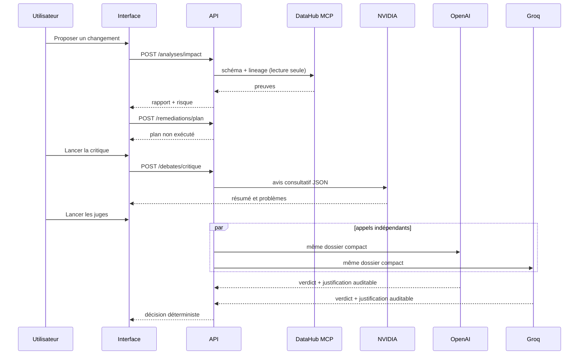

# Runbook d'exécution

Ce guide décrit l'installation, la configuration et le parcours de démonstration de LineageGuard AI sous Windows/PowerShell. Il ne contient aucune clé réelle.

## 1. Préparer l'environnement

Depuis la racine du dépôt :

```powershell
Copy-Item .env.example .env
python -m venv backend\.venv
backend\.venv\Scripts\python.exe -m pip install -e "backend[dev]"
Push-Location frontend
npm install
Pop-Location
```

Vérifier Docker :

```powershell
docker version
docker compose version
```

L'interface DataHub locale requiert Docker. L'application peut être testée sans fournisseurs IA, mais les boutons NVIDIA/OpenAI/Groq nécessitent leurs variables d'environnement.

## 2. Démarrer DataHub local

```powershell
.\scripts\start-datahub.ps1
```

Attendre que <http://localhost:9002> réponde, puis se connecter avec les identifiants de développement indiqués par le script. Pour recharger le jeu `showcase-ecommerce` :

```powershell
.\scripts\load-showcase-data.ps1
```

DataHub expose GMS sur le port `8080`. Dans un conteneur LineageGuard, employer `http://host.docker.internal:8080`; hors Docker, employer `http://localhost:8080`.

## 3. Fournisseurs IA et clés

Créez les clés uniquement dans les consoles officielles, copiez-les directement dans `.env`, puis ne les affichez plus dans un terminal, un chat ou une capture.

| Rôle | Variable | Fournisseur | Remarque |
|---|---|---|---|
| Critique consultative | `NVIDIA_API_KEY` | NVIDIA Build | Le modèle est configurable ; `z-ai/glm-5.2` est l'exemple retenu pour cette démo. |
| Juge de grounding | `OPENAI_API_KEY` | OpenAI | Le modèle est défini par `OPENAI_JUDGE_MODEL`. |
| Juge technique/sécurité | `GROQ_API_KEY` | Groq | Le modèle est défini par `GROQ_JUDGE_MODEL`. |
| Tracing facultatif | `LANGCHAIN_API_KEY` | LangSmith | Ne l'activer que si le tracing est réellement utilisé. |

Configuration minimale recommandée :

```env
WORKER_LLM_PROVIDER=nvidia
WORKER_LLM_MODEL=z-ai/glm-5.2
NVIDIA_BASE_URL=https://integrate.api.nvidia.com/v1
NVIDIA_API_KEY=...
NVIDIA_CRITIC_MODEL=z-ai/glm-5.2
NVIDIA_TIMEOUT_SECONDS=90

OPENAI_API_KEY=...
OPENAI_JUDGE_MODEL=gpt-4.1-mini
GROQ_API_KEY=...
GROQ_JUDGE_MODEL=openai/gpt-oss-20b
JUDGE_TEMPERATURE=0
JUDGE_TIMEOUT_SECONDS=60
JUDGE_MAX_RETRIES=1
```

Après toute exposition accidentelle d'une clé, révoquez-la dans la console du fournisseur et remplacez-la dans `.env`. Ne conservez pas la clé dans l'historique PowerShell.

## 4. Lancer l'application

```powershell
docker compose up --build -d
docker compose ps
```

Les deux services `backend` et `frontend` doivent être `healthy` :

```powershell
Invoke-RestMethod http://localhost:8000/api/v1/health
```

Ouvrir ensuite <http://localhost:5173>.



## 5. Procédure de démonstration

1. Garder l'URN exemple ou rechercher un actif dans DataHub.
2. Utiliser un `ADD_COLUMN` nullable pour une première démonstration simple. Les cas `DROP_COLUMN` et `CHANGE_COLUMN_TYPE` sont volontairement plus risqués.
3. Vérifier que le rapport indique des actifs, preuves, limites et formule de risque.
4. Lancer la critique NVIDIA et examiner son résumé. Elle ne modifie rien.
5. Lancer OpenAI + Groq. Cet acte peut consommer les quotas/crédits configurés.
6. Ouvrir les justifications auditées ; elles ne sont pas des chaînes de pensée privées.
7. En cas de `NEEDS_REPAIR`, corriger les hypothèses ou les contrats. En cas de `FINALIZE_READ_ONLY`, préparer éventuellement une proposition HITL.

## 6. Write-back : procédure contrôlée

Par défaut :

```env
DATAHUB_WRITEBACK_ENABLED=false
```

Ce réglage est recommandé pour le hackathon. L'approbation humaine peut être montrée, mais l'écriture DataHub est bloquée.

Pour préparer une proposition, il faut un `run_id` retourné par un double `PASS` et une clé d'idempotence. L'interface la génère automatiquement. Avant d'activer une écriture réelle, vérifier :

- l'actif cible et le contenu du document ;
- le snapshot préparé ;
- l'historique d'audit ;
- l'accord humain explicite ;
- le fait que l'environnement DataHub est bien un environnement de démo.

L'activation de `DATAHUB_WRITEBACK_ENABLED=true` est une action sensible. Recréez ensuite le backend :

```powershell
docker compose up -d --force-recreate backend
```

Ne l'activez jamais pour contourner un échec de juge ou sans examiner la proposition.

## 7. Vérifications qualité

```powershell
Push-Location backend
.\.venv\Scripts\python.exe -m pytest -p no:cacheprovider tests
Pop-Location

Push-Location frontend
npm run check
Pop-Location

docker compose ps
```

Les tests unitaires n'appellent pas NVIDIA, OpenAI, Groq ni DataHub externe. Les tests d'intégration DataHub sont explicitement activés :

```powershell
$env:RUN_DATAHUB_INTEGRATION = '1'
$env:PYTHONPATH = (Join-Path (Get-Location) 'backend')
python -m pytest backend\tests\integration
```
